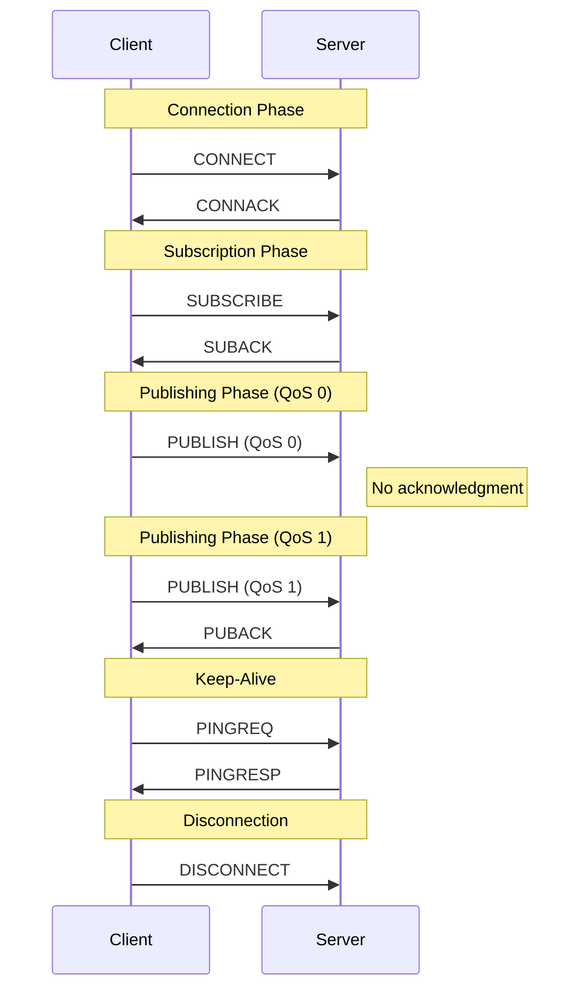

# Section 4.1: Packet Structure

> This section is part of [Section 4: Control Packet Format](./04.01-packet-structure.md).
> 
> - Next: [Section 4.2: Fixed Header](./04.02-fixed-header.md)

---

## 4.1 Structure of an MQTT Control Packet

The MQTT protocol works by exchanging a series of MQTT Control Packets in a defined way. This section describes the format of these packets.

An MQTT Control Packet consists of up to three parts, always in the following order:

### Figure 4-1: MQTT Control Packet Structure

```
┌────────────────────────────────────────────────────┐
│              Fixed Header (Required)               │
│         Present in ALL Control Packets             │
├────────────────────────────────────────────────────┤
│            Variable Header (Conditional)           │
│        Present in SOME Control Packets             │
├────────────────────────────────────────────────────┤
│               Payload (Conditional)                │
│        Present in SOME Control Packets             │
└────────────────────────────────────────────────────┘
```

### Table 4-1: Control Packet Components

| Component | Presence | Description |
|-----------|----------|-------------|
| Fixed Header | All packets | Contains packet type and remaining length |
| Variable Header | Some packets | Contains packet-specific data |
| Payload | Some packets | Contains application data or protocol data |

## 4.2 Control Packet Types

MQTT defines 14 Control Packet types, plus two reserved values:

### Table 4-2: Control Packet Types

| Name | Value | Direction | Description |
|------|-------|-----------|-------------|
| Reserved | 0 | Forbidden | Reserved |
| CONNECT | 1 | Client → Server | Client request to connect to Server |
| CONNACK | 2 | Server → Client | Connect acknowledgment |
| PUBLISH | 3 | Client ↔ Server | Publish message |
| PUBACK | 4 | Client ↔ Server | Publish acknowledgment (QoS 1) |
| PUBREC | 5 | Client ↔ Server | Publish received (QoS 2 part 1) |
| PUBREL | 6 | Client ↔ Server | Publish release (QoS 2 part 2) |
| PUBCOMP | 7 | Client ↔ Server | Publish complete (QoS 2 part 3) |
| SUBSCRIBE | 8 | Client → Server | Client subscribe request |
| SUBACK | 9 | Server → Client | Subscribe acknowledgment |
| UNSUBSCRIBE | 10 | Client → Server | Unsubscribe request |
| UNSUBACK | 11 | Server → Client | Unsubscribe acknowledgment |
| PINGREQ | 12 | Client → Server | PING request |
| PINGRESP | 13 | Server → Client | PING response |
| DISCONNECT | 14 | Client → Server | Client is disconnecting |
| Reserved | 15 | Forbidden | Reserved |

## 4.3 Packet Flow Summary

### Figure 4-2: Typical Packet Exchange



## 4.4 Navigation

- [Fixed Header](./04.02-fixed-header.md) - Byte 1 (packet type and flags) and Remaining Length
- [Variable Header](./04.03-variable-header.md) - Packet-specific header fields
- [Payload](./04.04-payload.md) - Packet-specific payload requirements
