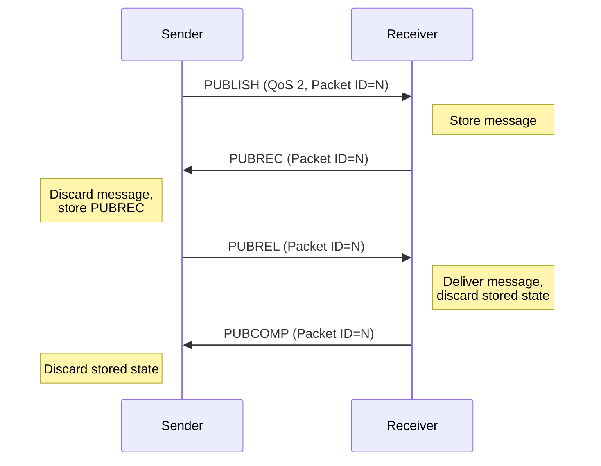

# Section 5.4: PUBACK, PUBREC, PUBREL, PUBCOMP

> This section is part of [Section 5: Control Packets](./05.01-connect.md).
> 
> - Previous: [Section 5.3: PUBLISH](./05.03-publish.md)
> - Next: [Section 5.5: SUBSCRIBE and SUBACK](./05.05-subscribe.md)

---

## 5.4.1 PUBACK – Publish Acknowledgement

A PUBACK Packet is the response to a PUBLISH Packet with QoS level 1.

### 5.4.1.1 Fixed Header

### Figure 5-9: PUBACK Packet Fixed Header

```
Bit         7   6   5   4   3   2   1   0
          ┌───────────────┬───────────────┐
byte 1    │  0   1   0   0│  0   0   0   0│  = 0x40
          │  Packet Type  │   Reserved    │
          └───────────────┴───────────────┘
byte 2    │  0   0   0   0   0   0   1   0│  = 0x02
          │     Remaining Length (2)      │
          └───────────────────────────────┘
```

### 5.4.1.2 Variable Header

Contains the Packet Identifier from the PUBLISH Packet that is being acknowledged.

### Figure 5-10: PUBACK Packet Variable Header

```
Bit         7   6   5   4   3   2   1   0
          ┌───────────────────────────────┐
byte 1    │    Packet Identifier MSB      │
          ├───────────────────────────────┤
byte 2    │    Packet Identifier LSB      │
          └───────────────────────────────┘
```

### 5.4.1.3 Payload

The PUBACK Packet has no payload.

### 5.4.1.4 Actions

This is described in [Section 7.2: QoS 1](./07-qos.md#72-qos-1-at-least-once-delivery).

---

## 5.4.2 PUBREC – Publish Received (QoS 2 Part 1)

A PUBREC Packet is the response to a PUBLISH Packet with QoS 2. It is the second packet of the QoS 2 protocol exchange.

### 5.4.2.1 Fixed Header

### Figure 5-11: PUBREC Packet Fixed Header

```
Bit         7   6   5   4   3   2   1   0
          ┌───────────────┬───────────────┐
byte 1    │  0   1   0   1│  0   0   0   0│  = 0x50
          │  Packet Type  │   Reserved    │
          └───────────────┴───────────────┘
byte 2    │  0   0   0   0   0   0   1   0│  = 0x02
          │     Remaining Length (2)      │
          └───────────────────────────────┘
```

### 5.4.2.2 Variable Header

Contains the Packet Identifier from the PUBLISH Packet that is being acknowledged.

### Figure 5-12: PUBREC Packet Variable Header

```
Bit         7   6   5   4   3   2   1   0
          ┌───────────────────────────────┐
byte 1    │    Packet Identifier MSB      │
          ├───────────────────────────────┤
byte 2    │    Packet Identifier LSB      │
          └───────────────────────────────┘
```

### 5.4.2.3 Payload

The PUBREC Packet has no payload.

### 5.4.2.4 Actions

This is described in [Section 7.3: QoS 2](./07-qos.md#73-qos-2-exactly-once-delivery).

---

## 5.4.3 PUBREL – Publish Release (QoS 2 Part 2)

A PUBREL Packet is the response to a PUBREC Packet. It is the third packet of the QoS 2 protocol exchange.

### 5.4.3.1 Fixed Header

### Figure 5-13: PUBREL Packet Fixed Header

```
Bit         7   6   5   4   3   2   1   0
          ┌───────────────┬───────────────┐
byte 1    │  0   1   1   0│  0   0   1   0│  = 0x62
          │  Packet Type  │   Reserved    │
          └───────────────┴───────────────┘
byte 2    │  0   0   0   0   0   0   1   0│  = 0x02
          │     Remaining Length (2)      │
          └───────────────────────────────┘
```

**[MQTT-3.6.1-1]** Bits 3,2,1,0 of the fixed header in the PUBREL Control Packet are reserved and MUST be set to 0,0,1,0 respectively. The Server MUST treat any other value as malformed and close the Network Connection.

### 5.4.3.2 Variable Header

Contains the same Packet Identifier as the PUBREC Packet that is being acknowledged.

### Figure 5-14: PUBREL Packet Variable Header

```
Bit         7   6   5   4   3   2   1   0
          ┌───────────────────────────────┐
byte 1    │    Packet Identifier MSB      │
          ├───────────────────────────────┤
byte 2    │    Packet Identifier LSB      │
          └───────────────────────────────┘
```

### 5.4.3.3 Payload

The PUBREL Packet has no payload.

### 5.4.3.4 Actions

This is described in [Section 7.3: QoS 2](./07-qos.md#73-qos-2-exactly-once-delivery).

---

## 5.4.4 PUBCOMP – Publish Complete (QoS 2 Part 3)

The PUBCOMP Packet is the response to a PUBREL Packet. It is the fourth and final packet of the QoS 2 protocol exchange.

### 5.4.4.1 Fixed Header

### Figure 5-15: PUBCOMP Packet Fixed Header

```
Bit         7   6   5   4   3   2   1   0
          ┌───────────────┬───────────────┐
byte 1    │  0   1   1   1│  0   0   0   0│  = 0x70
          │  Packet Type  │   Reserved    │
          └───────────────┴───────────────┘
byte 2    │  0   0   0   0   0   0   1   0│  = 0x02
          │     Remaining Length (2)      │
          └───────────────────────────────┘
```

### 5.4.4.2 Variable Header

Contains the same Packet Identifier as the PUBREL Packet that is being acknowledged.

### Figure 5-16: PUBCOMP Packet Variable Header

```
Bit         7   6   5   4   3   2   1   0
          ┌───────────────────────────────┐
byte 1    │    Packet Identifier MSB      │
          ├───────────────────────────────┤
byte 2    │    Packet Identifier LSB      │
          └───────────────────────────────┘
```

### 5.4.4.3 Payload

The PUBCOMP Packet has no payload.

### 5.4.4.4 Actions

This is described in [Section 7.3: QoS 2](./07-qos.md#73-qos-2-exactly-once-delivery).

---

## 5.4.5 QoS 2 Message Exchange Summary

### Figure 5-17: QoS 2 Protocol Flow



### Table 5-6: QoS 2 Packet Summary

| Packet | Direction | Fixed Header Byte 1 | Purpose |
|--------|-----------|--------------------|---------| 
| PUBLISH | Sender → Receiver | 0x34 (QoS 2) | Deliver message |
| PUBREC | Receiver → Sender | 0x50 | Acknowledge receipt |
| PUBREL | Sender → Receiver | 0x62 | Release message |
| PUBCOMP | Receiver → Sender | 0x70 | Complete transaction |
