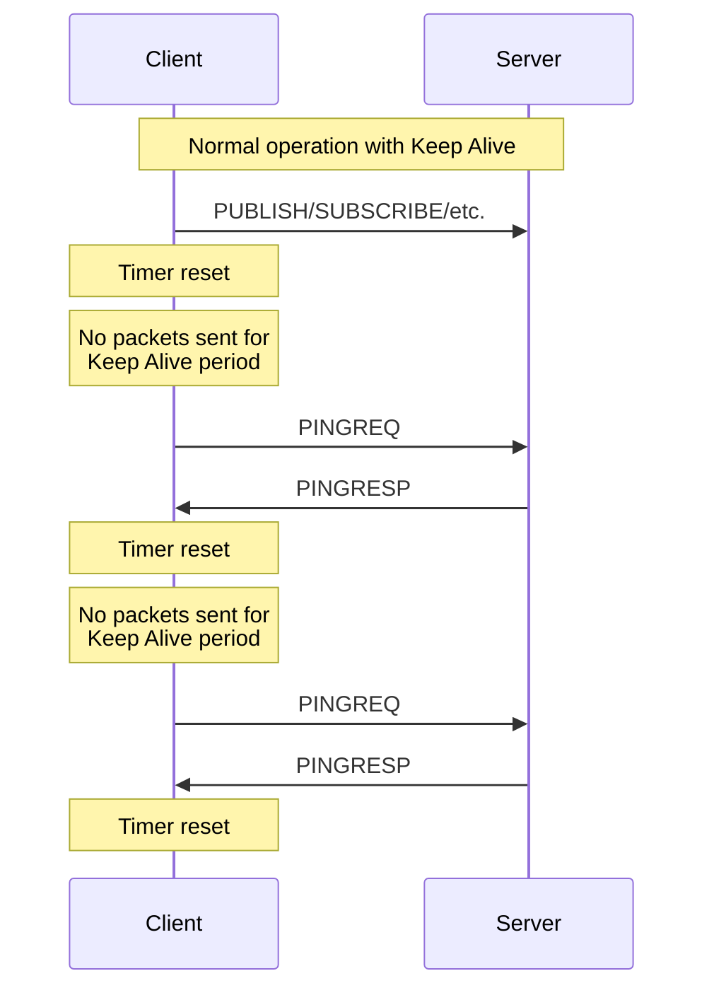

# Section 5.7: PINGREQ and PINGRESP

> This section is part of [Section 5: Control Packets](./05.01-connect.md).
> 
> - Previous: [Section 5.6: UNSUBSCRIBE and UNSUBACK](./05.06-unsubscribe.md)
> - Next: [Section 5.8: DISCONNECT](./05.08-disconnect.md)

---

## 5.7.1 PINGREQ – PING Request

The PINGREQ Packet is sent from a Client to the Server. It can be used to:

1. Indicate to the Server that the Client is alive in the absence of any other Control Packets being sent from the Client to the Server
2. Request that the Server responds to confirm that it is alive
3. Exercise the network to indicate that the Network Connection is active

This Packet is used in Keep Alive processing. See [Section 5.1.3.10](./05.01-connect.md#51310-keep-alive) for more details.

### 5.7.1.1 Fixed Header

### Figure 5-29: PINGREQ Packet Fixed Header

```
Bit         7   6   5   4   3   2   1   0
          ┌───────────────┬───────────────┐
byte 1    │  1   1   0   0│  0   0   0   0│  = 0xC0
          │  Packet Type  │   Reserved    │
          └───────────────┴───────────────┘
byte 2    │  0   0   0   0   0   0   0   0│  = 0x00
          │     Remaining Length (0)      │
          └───────────────────────────────┘
```

### 5.7.1.2 Variable Header

The PINGREQ Packet has no variable header.

### 5.7.1.3 Payload

The PINGREQ Packet has no payload.

### 5.7.1.4 Response

The Server MUST send a PINGRESP Packet in response to a PINGREQ Packet **[MQTT-3.12.4-1]**.

---

## 5.7.2 PINGRESP – PING Response

A PINGRESP Packet is sent by the Server to the Client in response to a PINGREQ Packet. It indicates that the Server is alive.

This Packet is used in Keep Alive processing. See [Section 5.1.3.10](./05.01-connect.md#51310-keep-alive) for more details.

### 5.7.2.1 Fixed Header

### Figure 5-30: PINGRESP Packet Fixed Header

```
Bit         7   6   5   4   3   2   1   0
          ┌───────────────┬───────────────┐
byte 1    │  1   1   0   1│  0   0   0   0│  = 0xD0
          │  Packet Type  │   Reserved    │
          └───────────────┴───────────────┘
byte 2    │  0   0   0   0   0   0   0   0│  = 0x00
          │     Remaining Length (0)      │
          └───────────────────────────────┘
```

### 5.7.2.2 Variable Header

The PINGRESP Packet has no variable header.

### 5.7.2.3 Payload

The PINGRESP Packet has no payload.

---

## 5.7.3 Keep Alive Usage

### Figure 5-31: Keep Alive Exchange



### Table 5-11: PING Packet Summary

| Packet | Direction | Size | Purpose |
|--------|-----------|------|---------|
| PINGREQ | Client → Server | 2 bytes | Keep alive, check server |
| PINGRESP | Server → Client | 2 bytes | Confirm server alive |

> **Note:** If a Client does not receive a PINGRESP Packet within a reasonable amount of time after it has sent a PINGREQ, it SHOULD close the Network Connection to the Server.
