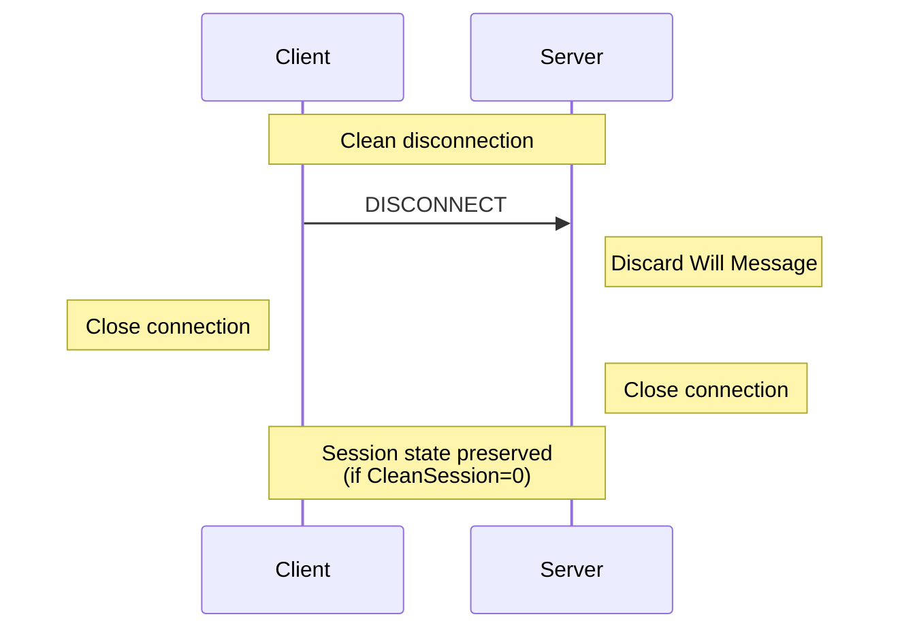
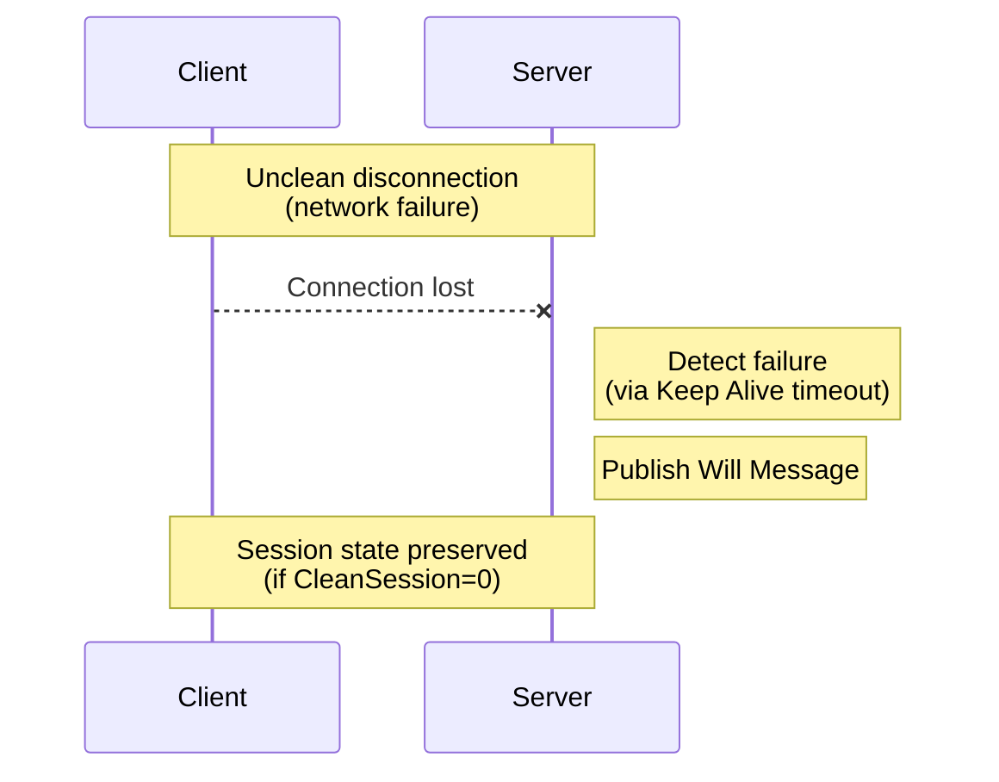

# Section 5.8: DISCONNECT – Disconnect Notification

> This section is part of [Section 5: Control Packets](./05.01-connect.md).
> 
> - Previous: [Section 5.7: PINGREQ and PINGRESP](./05.07-ping.md)
> - Up: [Section 5: Control Packets](./05.01-connect.md)

---

## 5.8.1 Overview

The DISCONNECT Packet is the final Control Packet sent from the Client to the Server. It indicates that the Client is disconnecting cleanly.

## 5.8.2 Fixed Header

### Figure 5-32: DISCONNECT Packet Fixed Header

```
Bit         7   6   5   4   3   2   1   0
          ┌───────────────┬───────────────┐
byte 1    │  1   1   1   0│  0   0   0   0│  = 0xE0
          │  Packet Type  │   Reserved    │
          └───────────────┴───────────────┘
byte 2    │  0   0   0   0   0   0   0   0│  = 0x00
          │     Remaining Length (0)      │
          └───────────────────────────────┘
```

## 5.8.3 Variable Header

The DISCONNECT Packet has no variable header.

## 5.8.4 Payload

The DISCONNECT Packet has no payload.

## 5.8.5 Response

The Server MUST NOT send any response to a DISCONNECT Packet.

**[MQTT-3.14.4-1]** After sending a DISCONNECT Packet the Client:
- MUST close the Network Connection
- MUST NOT send any more Control Packets on that Network Connection

**[MQTT-3.14.4-2]** On receipt of DISCONNECT the Server:
- MUST discard any Will Message associated with the current connection without publishing it (see [Section 5.1.3.5](./05.01-connect.md#5135-will-flag))
- SHOULD close the Network Connection if the Client has not already done so

## 5.8.6 Clean vs. Unclean Disconnection

### Table 5-12: Disconnection Behavior

| Scenario | Will Message | Session State |
|----------|--------------|---------------|
| DISCONNECT sent | NOT published | Preserved (if CleanSession=0) |
| Network failure | Published | Preserved (if CleanSession=0) |
| Keep Alive timeout | Published | Preserved (if CleanSession=0) |
| Protocol error | Published | Preserved (if CleanSession=0) |

### Figure 5-33: Clean Disconnection Flow



### Figure 5-34: Unclean Disconnection Flow



## 5.8.7 Wire Format

The complete DISCONNECT packet:

```
0xE0 0x00
```

This is the smallest possible MQTT Control Packet (2 bytes).
