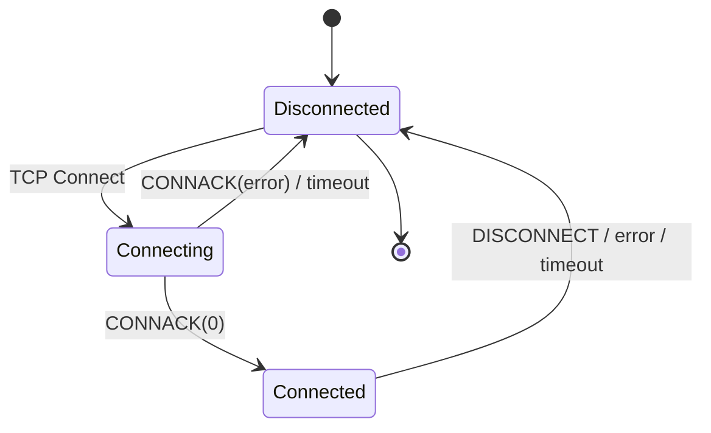

# Section 6: Operational Behavior

## 6.1 Storing State

The Client and Server need to store session state to enable reliable messaging across network connections.

### 6.1.1 Session State

**Client Session State:**
- QoS 1 and QoS 2 messages which have been sent to the Server, but have not been completely acknowledged
- QoS 2 messages which have been received from the Server, but have not been completely acknowledged

**Server Session State:**
- The existence of a Session, even if the rest of the Session state is empty
- The Client's subscriptions
- QoS 1 and QoS 2 messages which have been sent to the Client, but have not been completely acknowledged
- QoS 1 and QoS 2 messages pending transmission to the Client
- QoS 2 messages which have been received from the Client, but have not been completely acknowledged
- Optionally, QoS 0 messages pending transmission to the Client

### 6.1.2 State Storage Requirements

Implementations SHOULD provide persistent storage for session state to survive restarts. The storage mechanism is implementation-specific.

### Table 6-1: State Storage Requirements

| State Type | Client | Server |
|------------|--------|--------|
| Pending QoS 1 outbound | Required | Required |
| Pending QoS 2 outbound | Required | Required |
| Pending QoS 2 inbound | Required | Required |
| Subscriptions | N/A | Required |
| Retained messages | N/A | Required |
| Pending QoS 0 | Optional | Optional |

> **Note:** Retained messages are stored separately from Session state and MUST persist independently of Session lifecycle.

### 6.1.3 Non-Normative Example

An implementation might store:

```
Session {
    client_id: "device-001"
    subscriptions: ["sensors/#", "commands/device-001"]
    outbound_qos1: [
        { packet_id: 1, topic: "data", payload: "...", state: SENT }
    ]
    outbound_qos2: [
        { packet_id: 2, topic: "events", payload: "...", state: PUBREC_RECEIVED }
    ]
    inbound_qos2: [
        { packet_id: 100, state: PUBREC_SENT }
    ]
}
```

## 6.2 Network Connections

### 6.2.1 Connection Requirements

A Network Connection used by MQTT:

- Connects the Client to the Server
- Provides the means to send an ordered, lossless stream of bytes in both directions
- Is typically TCP/IP but could be any transport meeting these requirements

### 6.2.2 Supported Transports

**TCP/IP (Recommended)**
- Default port: 1883 (unencrypted)
- Secure port: 8883 (TLS/SSL)

**WebSocket**
- Provides MQTT over WebSocket for browser clients
- See [Section 10: WebSocket Transport](./10-websocket.md)

**Other Transports**
- Any ordered, lossless, bidirectional byte stream
- Examples: Unix sockets, Bluetooth, serial connections

### 6.2.3 Connection Lifecycle

### Figure 6-1: Connection State Machine



## 6.3 Message Delivery Retry

### 6.3.1 Retry Behavior

When a Client reconnects with CleanSession set to 0, both the Client and Server MUST re-send any unacknowledged PUBLISH packets (where QoS > 0) and PUBREL packets using their original Packet Identifiers. This is the only circumstance where a Client or Server is REQUIRED to re-send messages. **[MQTT-4.4.0-1]**

### 6.3.2 In-Flight Message Limits

Implementations MAY impose limits on the number of in-flight messages (messages that have been sent but not yet acknowledged). When such limits are reached, implementations SHOULD NOT send additional PUBLISH packets until some are acknowledged.

> **Note:** The protocol does not specify a maximum number of in-flight messages. Implementations should consider available memory and network conditions.

## 6.4 Message Receipt

### 6.4.1 Delivery Semantics

When a Server takes ownership of an incoming Application Message it MUST add it to the Session state of those Clients that have matching Subscriptions. **[MQTT-4.5.0-1]**

Matching rules are defined in [Section 8: Topic Names and Filters](./08-topics.md).

### 6.4.2 Message Delivery Order

A Client MUST follow these rules when implementing the protocol flows:

**[MQTT-4.6.0-1]** When a Client re-sends any PUBLISH packets, it MUST re-send them in the order in which the original PUBLISH packets were sent (this applies to QoS 1 and QoS 2 messages).

**[MQTT-4.6.0-2]** A Client MUST send PUBACK packets in the order in which the corresponding PUBLISH packets were received (QoS 1 messages).

**[MQTT-4.6.0-3]** A Client MUST send PUBREC packets in the order in which the corresponding PUBLISH packets were received (QoS 2 messages).

**[MQTT-4.6.0-4]** A Client MUST send PUBREL packets in the order in which the corresponding PUBREC packets were received (QoS 2 messages).

A Server MUST by default treat each Topic as an "Ordered Topic". It MAY provide an administrative or other mechanism to allow one or more Topics to be treated as "Unordered Topics". **[MQTT-4.6.0-5]**

**[MQTT-4.6.0-6]** When a Server processes a message that has been published to an Ordered Topic, it MUST follow the rules above when delivering messages to each of its subscribers. In addition, it MUST send PUBLISH packets to subscribers in the order in which messages were received from any given Client.

## 6.5 Error Handling

### 6.5.1 Protocol Errors

If a Server or Client encounters a protocol error it MUST close the Network Connection. **[MQTT-4.8.0-1]**

### Table 6-2: Protocol Error Examples

| Error | Required Action |
|-------|----------------|
| Invalid packet type | Close connection |
| Invalid remaining length | Close connection |
| Invalid UTF-8 | Close connection |
| Invalid flags | Close connection |
| Second CONNECT packet | Close connection |
| Invalid QoS (3) | Close connection |
| Malformed packet | Close connection |

### 6.5.2 Implementation Errors

Implementations SHOULD handle unexpected conditions gracefully:

- Memory exhaustion: Disconnect clients, reject new connections
- Storage failure: Attempt recovery, notify administrators
- Resource limits: Apply backpressure, reject new operations
