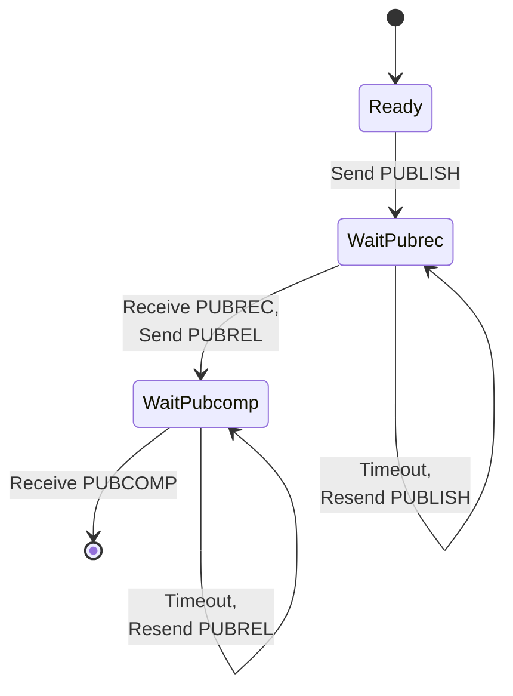
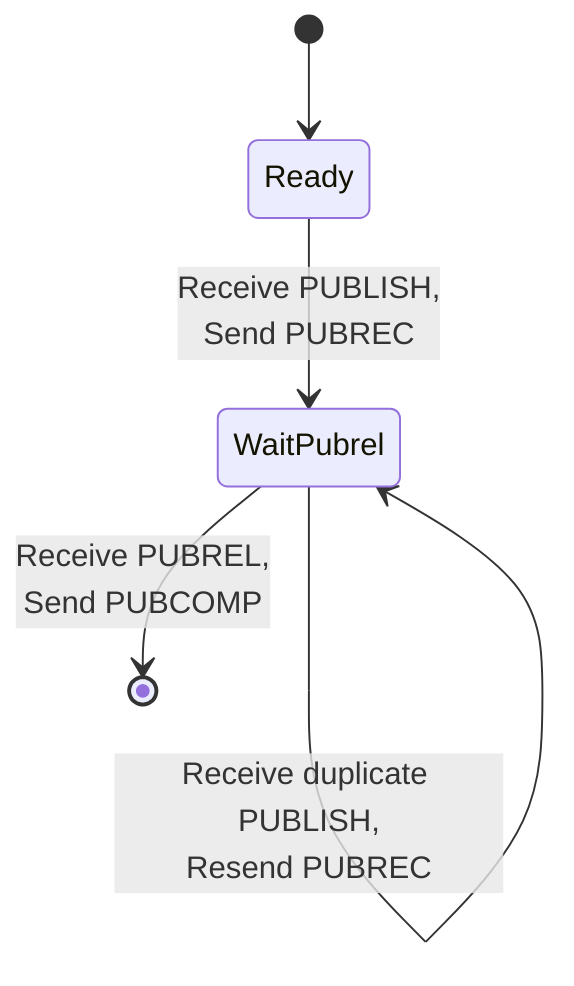

# Section 7: Quality of Service

## 7.1 QoS 0: At Most Once Delivery

The message is delivered according to the capabilities of the underlying network. No response is sent by the receiver and no retry is performed by the sender. The message arrives at the receiver either once or not at all.

### Figure 7-1: QoS 0 Protocol Flow

```
    Sender                              Receiver
       │                                   │
       │  PUBLISH (QoS 0) ─────────────►  │
       │                                   │
       │        No acknowledgment          │
       │                                   │
```

### 7.1.1 Sender Requirements

**[MQTT-4.3.1-1]** When a Client sends a QoS 0 PUBLISH packet:
- It MUST set DUP to 0
- It MUST set QoS to 0
- The packet MUST NOT contain a Packet Identifier

### 7.1.2 Receiver Requirements

When a Server or Client receives a QoS 0 PUBLISH:
- It delivers the message to relevant subscribers
- No acknowledgment is required or expected

### 7.1.3 Use Cases

QoS 0 is appropriate when:
- Message loss is acceptable
- Sensor data is sent frequently (missing one reading is not critical)
- Network is reliable and low-latency
- Minimal overhead is required

---

## 7.2 QoS 1: At Least Once Delivery

This quality of service ensures that the message arrives at the receiver at least once. A QoS 1 PUBLISH Packet has a Packet Identifier in its variable header and is acknowledged by a PUBACK Packet.

### Figure 7-2: QoS 1 Protocol Flow

```
    Sender                              Receiver
       │                                   │
       │  PUBLISH (QoS 1, DUP=0) ───────► │
       │                                   │
       │  ◄─────────────────────── PUBACK │
       │                                   │
```

### 7.2.1 Sender Requirements

**[MQTT-4.3.2-1]** When sending a QoS 1 PUBLISH:
- MUST assign an unused Packet Identifier
- MUST store the message until PUBACK is received
- MUST send PUBACK in response to incoming QoS 1 PUBLISH

**[MQTT-4.3.2-2]** The sender:
- MUST treat PUBACK as the completion acknowledgment
- MAY re-send PUBLISH with DUP=1 if no PUBACK received
- MUST NOT re-send while awaiting acknowledgment (unless reconnecting)

### 7.2.2 Receiver Requirements

When a QoS 1 PUBLISH is received:
- Process the message (deliver to subscribers or application)
- Send PUBACK with the same Packet Identifier

The receiver MAY begin processing before sending PUBACK.

### 7.2.3 Message Duplication

Because the sender may re-send on timeout and the receiver acknowledges after processing, duplicate messages can occur:

```
    Sender                              Receiver
       │                                   │
       │  PUBLISH (QoS 1, ID=1) ─────────►│ Processed
       │                                   │
       │        (PUBACK lost)              │
       │                                   │
       │  PUBLISH (QoS 1, ID=1, DUP=1) ──►│ Duplicate!
       │                                   │
       │  ◄────────────────────── PUBACK  │
       │                                   │
```

### 7.2.4 Use Cases

QoS 1 is appropriate when:
- Message delivery must be guaranteed
- Duplicate messages can be handled by the application
- Command/control messages that are idempotent
- State updates where latest value matters

---

## 7.3 QoS 2: Exactly Once Delivery

This is the highest quality of service level, for use when neither loss nor duplication of messages is acceptable. There is an increased overhead associated with QoS 2.

### Figure 7-3: QoS 2 Protocol Flow

```
    Sender                              Receiver
       │                                   │
       │  PUBLISH (QoS 2) ─────────────►  │
       │                                   │ (Store message)
       │  ◄──────────────────────PUBREC   │
       │  (Discard message, store state)   │
       │                                   │
       │  PUBREL ──────────────────────►  │
       │                                   │ (Deliver, discard)
       │  ◄─────────────────────PUBCOMP   │
       │  (Discard state)                  │
       │                                   │
```

### 7.3.1 Sender Requirements

**[MQTT-4.3.3-1]** When sending a QoS 2 PUBLISH:
- MUST assign an unused Packet Identifier
- MUST store the message until PUBREC is received
- MUST send PUBREL when PUBREC is received
- MUST NOT re-send PUBLISH once PUBREC received

**[MQTT-4.3.3-2]** The sender:
- MUST store PUBREL until PUBCOMP is received
- MAY re-send PUBREL if no PUBCOMP received
- MUST treat PUBCOMP as completion

### 7.3.2 Receiver Requirements

**[MQTT-4.3.3-3]** When a QoS 2 PUBLISH is received:
- MUST store the Packet Identifier
- MAY store the message or process immediately
- MUST respond with PUBREC

**[MQTT-4.3.3-4]** When PUBREL is received:
- MUST respond with PUBCOMP
- MUST NOT cause duplicate delivery to onward recipients

### 7.3.3 State Machine

### Figure 7-4: QoS 2 Sender State Machine



### Figure 7-5: QoS 2 Receiver State Machine



### 7.3.4 Use Cases

QoS 2 is appropriate when:
- Exactly-once semantics are required
- Financial transactions
- Critical commands that must not be duplicated
- Billing or metering systems

---

## 7.4 QoS Downgrade

When a message flows through the system, the actual QoS used for delivery to a subscriber is the minimum of:
- The QoS with which the message was originally published
- The maximum QoS granted for the subscription

### Table 7-1: QoS Downgrade Matrix

| Published QoS | Subscription Max QoS | Delivery QoS |
|---------------|---------------------|--------------|
| 0 | 0 | 0 |
| 0 | 1 | 0 |
| 0 | 2 | 0 |
| 1 | 0 | 0 |
| 1 | 1 | 1 |
| 1 | 2 | 1 |
| 2 | 0 | 0 |
| 2 | 1 | 1 |
| 2 | 2 | 2 |

---

## 7.5 Comparison Summary

### Table 7-2: QoS Level Comparison

| Aspect | QoS 0 | QoS 1 | QoS 2 |
|--------|-------|-------|-------|
| Delivery guarantee | At most once | At least once | Exactly once |
| Message loss | Possible | No | No |
| Duplicates | No | Possible | No |
| Packets required | 1 | 2 | 4 |
| State stored | None | Until PUBACK | Until PUBCOMP |
| Latency | Lowest | Medium | Highest |
| Use case | Telemetry | Commands | Transactions |
