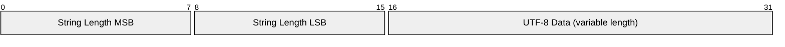
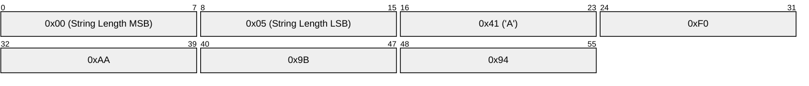

# 1.5 Data representations

## 1.5.1 Bits

Bits in a byte are labeled 7 through 0. Bit number 7 is the most significant bit, the least significant bit is assigned bit number 0.

## 1.5.2 Integer data values

Integer data values are 16 bits in big-endian order: the high order byte precedes the lower order byte. This means that a 16-bit word is presented on the network as Most Significant Byte (MSB), followed by Least Significant Byte (LSB).

## 1.5.3 UTF-8 encoded strings

Text fields in the Control Packets described later are encoded as UTF-8 strings. UTF-8 \[[RFC3629](#RFC3629)\] is an efficient encoding of Unicode \[[Unicode](#Unicode)\] characters that optimizes the encoding of ASCII characters in support of text-based communications.

Each of these strings is prefixed with a two byte length field that gives the number of bytes in a UTF-8 encoded string itself, as illustrated in [Figure 1.1 Structure of UTF-8 encoded strings](#_Figure_1.1_Structure) below. Consequently there is a limit on the size of a string that can be passed in one of these UTF-8 encoded string components; you cannot use a string that would encode to more than 65535 bytes.

Unless stated otherwise all UTF-8 encoded strings can have any length in the range 0 to 65535 bytes.

##### Figure 1.1 Structure of UTF-8 encoded strings

The character data in a UTF-8 encoded string MUST be well-formed UTF-8 as defined by the Unicode specification \[[Unicode](#Unicode)\] and restated in RFC 3629 \[[RFC3629](#RFC3629)\]. In particular this data MUST NOT include encodings of code points between U+D800 and U+DFFF. If a Server or Client receives a Control Packet containing ill-formed UTF-8 it MUST close the Network Connection \[MQTT-1.5.3-1\].

A UTF-8 encoded string MUST NOT include an encoding of the null character U+0000. If a receiver (Server or Client) receives a Control Packet containing U+0000 it MUST close the Network Connection \[MQTT-1.5.3-2\].

The data SHOULD NOT include encodings of the Unicode \[[Unicode](#Unicode)\] code points listed below. If a receiver (Server or Client) receives a Control Packet containing any of them it MAY close the Network Connection:

U+0001..U+001F control characters
U+007F..U+009F control characters
Code points defined in the Unicode specification \[[Unicode](#Unicode)\] to be non-characters (for example U+0FFFF)

A UTF-8 encoded sequence 0xEF 0xBB 0xBF is always to be interpreted to mean U+FEFF ("ZERO WIDTH NO-BREAK SPACE") wherever it appears in a string and MUST NOT be skipped over or stripped off by a packet receiver \[MQTT-1.5.3-3\].

### 1.5.3.1 Non normative example

For example, the string A 𪛔 which is LATIN CAPITAL Letter A followed by the code point U+2A6D4 (which represents a CJK IDEOGRAPH EXTENSION B character) is encoded as follows:

##### Figure 1.2 UTF-8 encoded string non normative example

