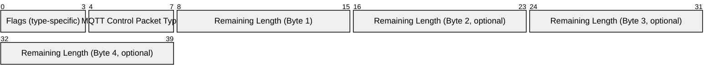

# 2.2 Fixed header

Each MQTT Control Packet contains a fixed header. [Figure 2.2 - Fixed header format](#_Figure_2.2_-) illustrates the fixed header format.

##### Figure 2.2 - Fixed header format



## 2.2.1 MQTT Control Packet type

**Position:** byte 1, bits 7-4.

Represented as a 4-bit unsigned value, the values are listed in [Table 2.1 - Control packet types](#_Table_2.1_-).

##### Table 2.1 - Control packet types

| **Name**    | **Value** |                                                     | **Direction of flow** | **Description**                            |
| ----------- | --------- | --------------------------------------------------- | --------------------- | ------------------------------------------ |
| Reserved    | 0         | Forbidden                                           |                       | Reserved                                   |
| CONNECT     | 1         | Client to Server                                    |                       | Client request to connect to Server        |
| CONNACK     | 2         | Server to Client                                    |                       | Connect acknowledgment                     |
| PUBLISH     | 3         | Client to Server<br><br> or<br><br>Server to Client |                       | Publish message                            |
| PUBACK      | 4         | Client to Server<br><br> or<br><br>Server to Client |                       | Publish acknowledgment                     |
| PUBREC      | 5         | Client to Server<br><br> or<br><br>Server to Client |                       | Publish received (assured delivery part 1) |
| PUBREL      | 6         | Client to Server<br><br> or<br><br>Server to Client |                       | Publish release (assured delivery part 2)  |
| PUBCOMP     | 7         | Client to Server<br><br> or<br><br>Server to Client |                       | Publish complete (assured delivery part 3) |
| SUBSCRIBE   | 8         | Client to Server                                    |                       | Client subscribe request                   |
| SUBACK      | 9         | Server to Client                                    |                       | Subscribe acknowledgment                   |
| UNSUBSCRIBE | 10        | Client to Server                                    |                       | Unsubscribe request                        |
| UNSUBACK    | 11        | Server to Client                                    |                       | Unsubscribe acknowledgment                 |
| PINGREQ     | 12        | Client to Server                                    |                       | PING request                               |
| PINGRESP    | 13        | Server to Client                                    |                       | PING response                              |
| DISCONNECT  | 14        | Client to Server                                    |                       | Client is disconnecting                    |
| Reserved    | 15        | Forbidden                                           |                       | Reserved                                   |

## 2.2.2 Flags

The remaining bits \[3-0\] of byte 1 in the fixed header contain flags specific to each MQTT Control Packet type as listed in the [Table 2.2 - Flag Bits](#_Table_2.2_-) below. Where a flag bit is marked as `Reserved` in [Table 2.2 - Flag Bits](#_Table_2.2_-), it is reserved for future use and MUST be set to the value listed in that table \[MQTT-2.2.2-1\]. If invalid flags are received, the receiver MUST close the Network Connection \[MQTT-2.2.2-2\]. See Section 4.8 for details about handling errors.

##### Table 2.2 - Flag Bits

| **Control Packet** | **Fixed header flags** | **Bit 3** | **Bit 2** | **Bit 1** | **Bit 0** |
| ------------------ | ---------------------- | --------- | --------- | --------- | --------- |
| CONNECT            | Reserved               | 0         | 0         | 0         | 0         |
| CONNACK            | Reserved               | 0         | 0         | 0         | 0         |
| PUBLISH            | Used in MQTT 3.1.1     | DUP1      | QoS2      | QoS2      | RETAIN3   |
| PUBACK             | Reserved               | 0         | 0         | 0         | 0         |
| PUBREC             | Reserved               | 0         | 0         | 0         | 0         |
| PUBREL             | Reserved               | 0         | 0         | 1         | 0         |
| PUBCOMP            | Reserved               | 0         | 0         | 0         | 0         |
| SUBSCRIBE          | Reserved               | 0         | 0         | 1         | 0         |
| SUBACK             | Reserved               | 0         | 0         | 0         | 0         |
| UNSUBSCRIBE        | Reserved               | 0         | 0         | 1         | 0         |
| UNSUBACK           | Reserved               | 0         | 0         | 0         | 0         |
| PINGREQ            | Reserved               | 0         | 0         | 0         | 0         |
| PINGRESP           | Reserved               | 0         | 0         | 0         | 0         |
| DISCONNECT         | Reserved               | 0         | 0         | 0         | 0         |

DUP1 = Duplicate delivery of a PUBLISH Control Packet

QoS2 = PUBLISH Quality of Service

RETAIN3 = PUBLISH Retain flag

See Section 3.3.1 for a description of the DUP, QoS, and RETAIN flags in the PUBLISH Control Packet.

## 2.2.3 Remaining Length

**Position:** starts at byte 2.

The Remaining Length is the number of bytes remaining within the current packet, including data in the variable header and the payload. The Remaining Length does not include the bytes used to encode the Remaining Length.

The Remaining Length is encoded using a variable length encoding scheme which uses a single byte for values up to 127. Larger values are handled as follows. The least significant seven bits of each byte encode the data, and the most significant bit is used to indicate that there are following bytes in the representation. Thus each byte encodes 128 values and a "continuation bit". The maximum number of bytes in the Remaining Length field is four.

**Non normative comment**

For example, the number 64 decimal is encoded as a single byte, decimal value 64, hexadecimal 0x40. The number 321 decimal (= 65 + 2\*128) is encoded as two bytes, least significant first. The first byte is 65+128 = 193. Note that the top bit is set to indicate at least one following byte. The second byte is 2.

**Non normative comment**

This allows applications to send Control Packets of size up to 268,435,455 (256 MB). The representation of this number on the wire is: 0xFF, 0xFF, 0xFF, 0x7F.

[Table 2.4](#_Table_2.4_Size) shows the Remaining Length values represented by increasing numbers of bytes.

##### Table 2.4 Size of Remaining Length field

| **Digits** | **From**                           | **To**                               |
| ---------- | ---------------------------------- | ------------------------------------ |
| 1          | 0 (0x00)                           | 127 (0x7F)                           |
| 2          | 128 (0x80, 0x01)                   | 16 383 (0xFF, 0x7F)                  |
| 3          | 16 384 (0x80, 0x80, 0x01)          | 2 097 151 (0xFF, 0xFF, 0x7F)         |
| 4          | 2 097 152 (0x80, 0x80, 0x80, 0x01) | 268 435 455 (0xFF, 0xFF, 0xFF, 0x7F) |

**Non normative comment**

The algorithm for encoding a non negative integer (X) into the variable length encoding scheme is as follows:

```
do

encodedByte = X MOD 128

X = X DIV 128

// if there are more data to encode, set the top bit of this byte

if ( X > 0 )

encodedByte = encodedByte OR 128

endif

'output' encodedByte

while ( X > 0 )

Where MOD is the modulo operator (% in C), DIV is integer division (/ in C), and OR is bit-wise or (| in C).

```

**Non normative comment**

The algorithm for decoding the Remaining Length field is as follows:

```
multiplier = 1

value = 0

do

encodedByte = 'next byte from stream'

value += (encodedByte AND 127) \* multiplier

multiplier \*= 128

if (multiplier > 128\*128\*128)

throw Error(Malformed Remaining Length)

while ((encodedByte AND 128) != 0)

where AND is the bit-wise and operator (& in C).

```

When this algorithm terminates, value contains the Remaining Length value.
