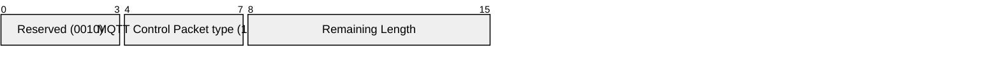
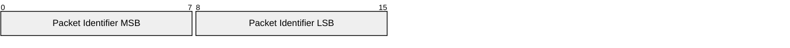
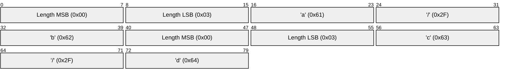

# 3.10 UNSUBSCRIBE – Unsubscribe from topics

An UNSUBSCRIBE Packet is sent by the Client to the Server, to unsubscribe from topics.

### 3.10.1 Fixed header

##### Figure 3.28 – UNSUBSCRIBE Packet Fixed header

Bits 3,2,1 and 0 of the fixed header of the UNSUBSCRIBE Control Packet are reserved and MUST be set to 0,0,1 and 0 respectively. The Server MUST treat any other value as malformed and close the Network Connection \[MQTT-3.10.1-1\].

**Remaining Length field**

This is the length of variable header (2 bytes) plus the length of the payload.

### 3.10.2 Variable header

The variable header contains a Packet Identifier. Section 2.3.1 provides more information about Packet Identifiers.

##### Figure 3.29 – UNSUBSCRIBE Packet variable header

### 3.10.3 Payload

The payload for the UNSUBSCRIBE Packet contains the list of Topic Filters that the Client wishes to unsubscribe from. The Topic Filters in an UNSUBSCRIBE packet MUST be UTF-8 encoded strings as defined in Section 1.5.3, packed contiguously \[MQTT-3.10.3-1\].

The Payload of an UNSUBSCRIBE packet MUST contain at least one Topic Filter. An UNSUBSCRIBE packet with no payload is a protocol violation \[MQTT-3.10.3-2\]. See section 4.8 for information about handling errors.

#### 3.10.3.1 Payload non normative example

[Figure 3.30 - Payload byte format non normative example](#_Figure_3.30_-) show the payload for the UNSUBSCRIBE Packet briefly described in [Table3.7 - Payload non normative example](#_Table3.6_-_Payload).

##### Table 3.7 - Payload non normative example

| **Field**    | **Value** |
| ------------ | --------- |
| Topic Filter | `a/b`     |
| Topic Filter | `c/d`     |

##### Figure 3.30 - Payload byte format non normative example

### 3.10.4 Response

The Topic Filters (whether they contain wildcards or not) supplied in an UNSUBSCRIBE packet MUST be compared character-by-character with the current set of Topic Filters held by the Server for the Client. If any filter matches exactly then its owning Subscription is deleted, otherwise no additional processing occurs \[MQTT-3.10.4-1\].

If a Server deletes a Subscription:

- It MUST stop adding any new messages for delivery to the Client \[MQTT-3.10.4-2\].
- It MUST complete the delivery of any QoS 1 or QoS 2 messages which it has started to send to the Client \[MQTT-3.10.4-3\].
- It MAY continue to deliver any existing messages buffered for delivery to the Client.

The Server MUST respond to an UNSUBSUBCRIBE request by sending an UNSUBACK packet. The UNSUBACK Packet MUST have the same Packet Identifier as the UNSUBSCRIBE Packet \[MQTT-3.10.4-4\]. Even where no Topic Subscriptions are deleted, the Server MUST respond with an UNSUBACK \[MQTT-3.10.4-5\].

If a Server receives an UNSUBSCRIBE packet that contains multiple Topic Filters it MUST handle that packet as if it had received a sequence of multiple UNSUBSCRIBE packets, except that it sends just one UNSUBACK response \[MQTT-3.10.4-6\].

