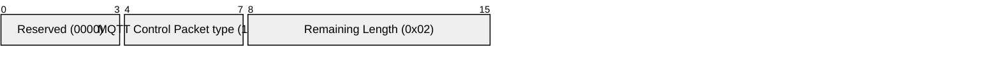
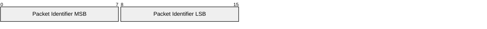

# 3.11 UNSUBACK – Unsubscribe acknowledgement

The UNSUBACK Packet is sent by the Server to the Client to confirm receipt of an UNSUBSCRIBE Packet.

### 3.11.1 Fixed header

##### Figure 3.31 – UNSUBACK Packet fixed header

**Remaining Length field**

This is the length of the variable header. For the UNSUBACK Packet this has the value 2.

### 3.11.2 Variable header

The variable header contains the Packet Identifier of the UNSUBSCRIBE Packet that is being acknowledged.

##### Figure 3.32 – UNSUBACK Packet variable header

### 3.11.3 Payload

The UNSUBACK Packet has no payload.

