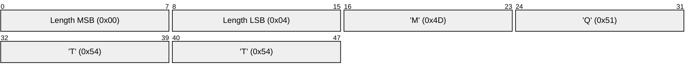
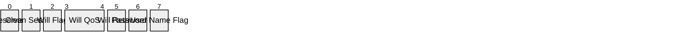
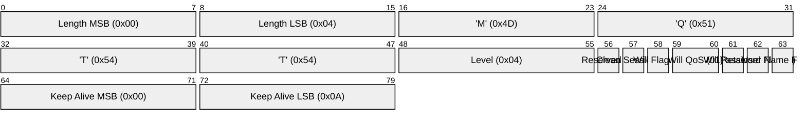

# 3.1 CONNECT – Client requests a connection to a Server

After a Network Connection is established by a Client to a Server, the first Packet sent from the Client to the Server MUST be a CONNECT Packet \[MQTT-3.1.0-1\].

A Client can only send the CONNECT Packet once over a Network Connection. The Server MUST process a second CONNECT Packet sent from a Client as a protocol violation and disconnect the Client \[MQTT-3.1.0-2\]. See section 4.8 for information about handling errors.

The payload contains one or more encoded fields. They specify a unique Client identifier for the Client, a Will topic, Will Message, User Name and Password. All but the Client identifier are optional and their presence is determined based on flags in the variable header.

### 3.1.1 Fixed header

##### Figure 3.1 – CONNECT Packet fixed header

**Remaining Length field**

Remaining Length is the length of the variable header (10 bytes) plus the length of the Payload. It is encoded in the manner described in section 2.2.3.

### 3.1.2 Variable header

The variable header for the CONNECT Packet consists of four fields in the following order: Protocol Name, Protocol Level, Connect Flags, and Keep Alive.

#### 3.1.2.1 Protocol Name

##### Figure 3.2 - Protocol Name bytes

The Protocol Name is a UTF-8 encoded string that represents the protocol name `MQTT`, capitalized as shown. The string, its offset and length will not be changed by future versions of the MQTT specification.

If the protocol name is incorrect the Server MAY disconnect the Client, or it MAY continue processing the CONNECT packet in accordance with some other specification. In the latter case, the Server MUST NOT continue to process the CONNECT packet in line with this specification \[MQTT-3.1.2-1\].

**Non normative comment**

Packet inspectors, such as firewalls, could use the Protocol Name to identify MQTT traffic.

#### 3.1.2.2 Protocol Level

##### Figure 3.3 - Protocol Level byte

The 8 bit unsigned value that represents the revision level of the protocol used by the Client. The value of the Protocol Level field for the version 3.1.1 of the protocol is 4 (0x04). The Server MUST respond to the CONNECT Packet with a CONNACK return code 0x01 (unacceptable protocol level) and then disconnect the Client if the Protocol Level is not supported by the Server \[MQTT-3.1.2-2\].

#### 3.1.2.3 Connect Flags

The Connect Flags byte contains a number of parameters specifying the behavior of the MQTT connection. It also indicates the presence or absence of fields in the payload.

##### Figure 3.4 - Connect Flag bits

The Server MUST validate that the reserved flag in the CONNECT Control Packet is set to zero and disconnect the Client if it is not zero \[MQTT-3.1.2-3\].

#### 3.1.2.4 Clean Session

**Position:** bit 1 of the Connect Flags byte.

This bit specifies the handling of the Session state.

The Client and Server can store Session state to enable reliable messaging to continue across a sequence of Network Connections. This bit is used to control the lifetime of the Session state.

If CleanSession is set to 0, the Server MUST resume communications with the Client based on state from the current Session (as identified by the Client identifier). If there is no Session associated with the Client identifier the Server MUST create a new Session. The Client and Server MUST store the Session after the Client and Server are disconnected \[MQTT-3.1.2-4\]. After the disconnection of a Session that had CleanSession set to 0, the Server MUST store further QoS 1 and QoS 2 messages that match any subscriptions that the client had at the time of disconnection as part of the Session state \[[MQTT-3](https://tools.oasis-open.org/issues/browse/MQTT-3 "Keep alive interval grace period.").1.2-5\]. It MAY also store QoS 0 messages that meet the same criteria.

If CleanSession is set to 1, the Client and Server MUST discard any previous Session and start a new one. This Session lasts as long as the Network Connection. State data associated with this Session MUST NOT be reused in any subsequent Session \[MQTT-3.1.2-6\].

The Session state in the Client consists of:

- QoS 1 and QoS 2 messages which have been sent to the Server, but have not been completely acknowledged.

- QoS 2 messages which have been received from the Server, but have not been completely acknowledged.

The Session state in the Server consists of:

- The existence of a Session, even if the rest of the Session state is empty.

- The Client`s subscriptions.

- QoS 1 and QoS 2 messages which have been sent to the Client, but have not been completely acknowledged.

- QoS 1 and QoS 2 messages pending transmission to the Client.

- QoS 2 messages which have been received from the Client, but have not been completely acknowledged.

- Optionally, QoS 0 messages pending transmission to the Client.

Retained messages do not form part of the Session state in the Server, they MUST NOT be deleted when the Session ends \[MQTT-3.1.2.7\].

See Section 4.1 for details and limitations of stored state.

When CleanSession is set to 1 the Client and Server need not process the deletion of state atomically.

**Non normative comment**

To ensure consistent state in the event of a failure, the Client should repeat its attempts to connect with CleanSession set to 1, until it connects successfully.

**Non normative comment**

Typically, a Client will always connect using CleanSession set to 0 or CleanSession set to 1 and not swap between the two values. The choice will depend on the application. A Client using CleanSession set to 1 will not receive old Application Messages and has to subscribe afresh to any topics that it is interested in each time it connects. A Client using CleanSession set to 0 will receive all QoS 1 or QoS 2 messages that were published while it was disconnected. Hence, to ensure that you do not lose messages while disconnected, use QoS 1 or QoS 2 with CleanSession set to 0.

**Non normative comment**

When a Client connects with CleanSession set to 0, it is requesting that the Server maintain its MQTT session state after it disconnects. Clients should only connect with CleanSession set to 0, if they intend to reconnect to the Server at some later point in time. When a Client has determined that it has no further use for the session it should do a final connect with CleanSession set to 1 and then disconnect.

#### 3.1.2.5 Will Flag

**Position:** bit 2 of the Connect Flags.

If the Will Flag is set to 1 this indicates that, if the Connect request is accepted, a Will Message MUST be stored on the Server and associated with the Network Connection. The Will Message MUST be published when the Network Connection is subsequently closed unless the Will Message has been deleted by the Server on receipt of a DISCONNECT Packet \[MQTT-3.1.2-8\].

Situations in which the Will Message is published include, but are not limited to:

- An I/O error or network failure detected by the Server.
- The Client fails to communicate within the Keep Alive time.
- The Client closes the Network Connection without first sending a DISCONNECT Packet.
- The Server closes the Network Connection because of a protocol error.

If the Will Flag is set to 1, the Will QoS and Will Retain fields in the Connect Flags will be used by the Server, and the Will Topic and Will Message fields MUST be present in the payload \[MQTT-3.1.2-9\].

The Will Message MUST be removed from the stored Session state in the Server once it has been published or the Server has received a DISCONNECT packet from the Client \[MQTT-3.1.2-10\].

If the Will Flag is set to 0 the Will QoS and Will Retain fields in the Connect Flags MUST be set to zero and the Will Topic and Will Message fields MUST NOT be present in the payload \[MQTT-3.1.2-11\].

If the Will Flag is set to 0, a Will Message MUST NOT be published when this Network Connection ends \[MQTT-3.1.2-12\].

The Server SHOULD publish Will Messages promptly. In the case of a Server shutdown or failure the server MAY defer publication of Will Messages until a subsequent restart. If this happens there might be a delay between the time the server experienced failure and a Will Message being published.

#### 3.1.2.6 Will QoS

**Position:** bits 4 and 3 of the Connect Flags.

These two bits specify the QoS level to be used when publishing the Will Message.

If the Will Flag is set to 0, then the Will QoS MUST be set to 0 (0x00) \[MQTT-3.1.2-13\].

If the Will Flag is set to 1, the value of Will QoS can be 0 (0x00), 1 (0x01), or 2 (0x02). It MUST NOT be 3 (0x03) \[MQTT-3.1.2-14\].

#### 3.1.2.7 Will Retain

**Position:** bit 5 of the Connect Flags.

This bit specifies if the Will Message is to be Retained when it is published.

If the Will Flag is set to 0, then the Will Retain Flag MUST be set to 0 \[MQTT-3.1.2-15\].

If the Will Flag is set to 1:

- If Will Retain is set to 0, the Server MUST publish the Will Message as a non-retained message \[MQTT-3.1.2-16\].
- If Will Retain is set to 1, the Server MUST publish the Will Message as a retained message \[MQTT-3.1.2-17\].

#### 3.1.2.8 User Name Flag

**Position:** bit 7 of the Connect Flags.

If the User Name Flag is set to 0, a user name MUST NOT be present in the payload \[MQTT-3.1.2-18\].

If the User Name Flag is set to 1, a user name MUST be present in the payload \[MQTT-3.1.2-19\].

#### 3.1.2.9 Password Flag

**Position:** bit 6 of the Connect Flags byte.

If the Password Flag is set to 0, a password MUST NOT be present in the payload \[MQTT-3.1.2-20\].

If the Password Flag is set to 1, a password MUST be present in the payload \[MQTT-3.1.2-21\].

If the User Name Flag is set to 0, the Password Flag MUST be set to 0 \[MQTT-3.1.2-22\].

#### 3.1.2.10 Keep Alive

##### Figure 3.5 Keep Alive bytes

The Keep Alive is a time interval measured in seconds. Expressed as a 16-bit word, it is the maximum time interval that is permitted to elapse between the point at which the Client finishes transmitting one Control Packet and the point it starts sending the next. It is the responsibility of the Client to ensure that the interval between Control Packets being sent does not exceed the Keep Alive value. In the absence of sending any other Control Packets, the Client MUST send a PINGREQ Packet \[MQTT-3.1.2-23\].

The Client can send PINGREQ at any time, irrespective of the Keep Alive value, and use the PINGRESP to determine that the network and the Server are working.

If the Keep Alive value is non-zero and the Server does not receive a Control Packet from the Client within one and a half times the Keep Alive time period, it MUST disconnect the Network Connection to the Client as if the network had failed \[MQTT-3.1.2-24\].

If a Client does not receive a PINGRESP Packet within a reasonable amount of time after it has sent a PINGREQ, it SHOULD close the Network Connection to the Server.

A Keep Alive value of zero (0) has the effect of turning off the keep alive mechanism. This means that, in this case, the Server is not required to disconnect the Client on the grounds of inactivity.
Note that a Server is permitted to disconnect a Client that it determines to be inactive or non-responsive at any time, regardless of the Keep Alive value provided by that Client.

**Non normative comment**

The actual value of the Keep Alive is application specific; typically this is a few minutes. The maximum value is 18 hours 12 minutes and 15 seconds.

#### 3.1.2.11 Variable header non normative example

##### Figure 3.6 - Variable header non normative example

### 3.1.3 Payload

The payload of the CONNECT Packet contains one or more length-prefixed fields, whose presence is determined by the flags in the variable header. These fields, if present, MUST appear in the order Client Identifier, Will Topic, Will Message, User Name, Password \[MQTT-3.1.3-1\].

#### 3.1.3.1 Client Identifier

The Client Identifier (ClientId) identifies the Client to the Server. Each Client connecting to the Server has a unique ClientId. The ClientId MUST be used by Clients and by Servers to identify state that they hold relating to this MQTT Session between the Client and the Server \[MQTT-3.1.3-2\].

The Client Identifier (ClientId) MUST be present and MUST be the first field in the CONNECT packet payload \[MQTT-3.1.3-3\].

The ClientId MUST be a UTF-8 encoded string as defined in Section 1.5.3 \[MQTT-3.1.3-4\].

The Server MUST allow ClientIds which are between 1 and 23 UTF-8 encoded bytes in length, and that contain only the characters

"0123456789abcdefghijklmnopqrstuvwxyzABCDEFGHIJKLMNOPQRSTUVWXYZ" \[MQTT-3.1.3-5\].

The Server MAY allow ClientId`s that contain more than 23 encoded bytes. The Server MAY allow ClientId`s that contain characters not included in the list given above.

A Server MAY allow a Client to supply a ClientId that has a length of zero bytes, however if it does so the Server MUST treat this as a special case and assign a unique ClientId to that Client. It MUST then process the CONNECT packet as if the Client had provided that unique ClientId \[MQTT-3.1.3-6\].

If the Client supplies a zero-byte ClientId, the Client MUST also set CleanSession to 1 \[MQTT-3.1.3-7\].

If the Client supplies a zero-byte ClientId with CleanSession set to 0, the Server MUST respond to the CONNECT Packet with a CONNACK return code 0x02 (Identifier rejected) and then close the Network Connection \[MQTT-3.1.3-8\].

If the Server rejects the ClientId it MUST respond to the CONNECT Packet with a CONNACK return code 0x02 (Identifier rejected) and then close the Network Connection \[MQTT-3.1.3-9\].

**Non normative comment**

A Client implementation could provide a convenience method to generate a random ClientId. Use of such a method should be actively discouraged when the CleanSession is set to 0.

#### 3.1.3.2 Will Topic

If the Will Flag is set to 1, the Will Topic is the next field in the payload. The Will Topic MUST be a UTF-8 encoded string as defined in Section 1.5.3 \[MQTT-3.1.3-10\].

#### 3.1.3.3 Will Message

If the Will Flag is set to 1 the Will Message is the next field in the payload. The Will Message defines the Application Message that is to be published to the Will Topic as described in Section 3.1.2.5. This field consists of a two byte length followed by the payload for the Will Message expressed as a sequence of zero or more bytes. The length gives the number of bytes in the data that follows and does not include the 2 bytes taken up by the length itself.

When the Will Message is published to the Will Topic its payload consists only of the data portion of this field, not the first two length bytes.

#### 3.1.3.4 User Name

If the User Name Flag is set to 1, this is the next field in the payload. The User Name MUST be a UTF-8 encoded string as defined in Section 1.5.3 \[MQTT-3.1.3-11\]. It can be used by the Server for authentication and authorization.

#### 3.1.3.5 Password

If the Password Flag is set to 1, this is the next field in the payload. The Password field contains 0 to 65535 bytes of binary data prefixed with a two byte length field which indicates the number of bytes used by the binary data (it does not include the two bytes taken up by the length field itself).

##### Figure 3.7 - Password bytes

### 3.1.4 Response

Note that a Server MAY support multiple protocols (including earlier versions of this protocol) on the same TCP port or other network endpoint. If the Server determines that the protocol is MQTT 3.1.1 then it validates the connection attempt as follows.

1. If the Server does not receive a CONNECT Packet within a reasonable amount of time after the Network Connection is established, the Server SHOULD close the connection.

1. The Server MUST validate that the CONNECT Packet conforms to section 3.1 and close the Network Connection without sending a CONNACK if it does not conform \[MQTT-3.1.4-1\].

1. The Server MAY check that the contents of the CONNECT Packet meet any further restrictions and MAY perform authentication and authorization checks. If any of these checks fail, it SHOULD send an appropriate CONNACK response with a non-zero return code as described in section 3.2 and it MUST close the Network Connection.

If validation is successful the Server performs the following steps.

1. If the ClientId represents a Client already connected to the Server then the Server MUST disconnect the existing Client \[MQTT-3.1.4-2\].

2. The Server MUST perform the processing of CleanSession that is described in section 3.1.2.4 \[MQTT-3.1.4-3\].

3. The Server MUST acknowledge the CONNECT Packet with a CONNACK Packet containing a zero return code \[MQTT-3.1.4-4\].

4. Start message delivery and keep alive monitoring.

Clients are allowed to send further Control Packets immediately after sending a CONNECT Packet; Clients need not wait for a CONNACK Packet to arrive from the Server. If the Server rejects the CONNECT, it MUST NOT process any data sent by the Client after the CONNECT Packet \[MQTT-3.1.4-5\].

**Non normative comment**
Clients typically wait for a CONNACK Packet, However, if the Client exploits its freedom to send Control Packets before it receives a CONNACK, it might simplify the Client implementation as it does not have to police the connected state. The Client accepts that any data that it sends before it receives a CONNACK packet from the Server will not be processed if the Server rejects the connection.

