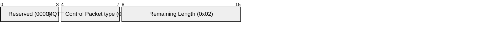
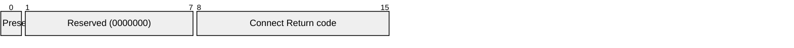

# 3.2 CONNACK – Acknowledge connection request

The CONNACK Packet is the packet sent by the Server in response to a CONNECT Packet received from a Client. The first packet sent from the Server to the Client MUST be a CONNACK Packet \[MQTT-3.2.0-1\].

If the Client does not receive a CONNACK Packet from the Server within a reasonable amount of time, the Client SHOULD close the Network Connection. A "reasonable" amount of time depends on the type of application and the communications infrastructure.

### 3.2.1 Fixed header

The fixed header format is illustrated in [Figure 3.8 – CONNACK Packet fixed header](#_Figure_3.8_–).

##### Figure 3.8 – CONNACK Packet fixed header

**Remaining Length field**

This is the length of the variable header. For the CONNACK Packet this has the value 2.

### 3.2.2 Variable header

The variable header format is illustrated in Figure 3.9 – CONNACK Packet variable header.

##### Figure 3.9 – CONNACK Packet variable header

#### 3.2.2.1 Connect Acknowledge Flags

Byte 1 is the "Connect Acknowledge Flags". Bits 7-1 are reserved and MUST be set to 0.

Bit 0 (SP1) is the Session Present Flag.

#### 3.2.2.2 Session Present

Position: bit 0 of the Connect Acknowledge Flags.

If the Server accepts a connection with CleanSession set to 1, the Server MUST set Session Present to 0 in the CONNACK packet in addition to setting a zero return code in the CONNACK packet \[MQTT-3.2.2-1\].

If the Server accepts a connection with CleanSession set to 0, the value set in Session Present depends on whether the Server already has stored Session state for the supplied client ID. If the Server has stored Session state, it MUST set Session Present to 1 in the CONNACK packet \[MQTT-3.2.2-2\]. If the Server does not have stored Session state, it MUST set Session Present to 0 in the CONNACK packet. This is in addition to setting a zero return code in the CONNACK packet \[MQTT-3.2.2-3\].

The Session Present flag enables a Client to establish whether the Client and Server have a consistent view about whether there is already stored Session state.

Once the initial setup of a Session is complete, a Client with stored Session state will expect the Server to maintain its stored Session state. In the event that the value of Session Present received by the Client from the Server is not as expected, the Client can choose whether to proceed with the Session or to disconnect. The Client can discard the Session state on both Client and Server by disconnecting, connecting with Clean Session set to 1 and then disconnecting again.

If a server sends a CONNACK packet containing a non-zero return code it MUST set Session Present to 0 \[MQTT-3.2.2-4\].

#### 3.2.2.3 Connect Return code

Byte 2 in the Variable header.

The values for the one byte unsigned Connect Return code field are listed in [Table 3.1 – Connect Return code values](#_Table_3.1_-). If a well formed CONNECT Packet is received by the Server, but the Server is unable to process it for some reason, then the Server SHOULD attempt to send a CONNACK packet containing the appropriate non-zero Connect return code from this table. If a server sends a CONNACK packet containing a non-zero return code it MUST then close the Network Connection \[MQTT-3.2.2-5\].

##### Table 3.1 – Connect Return code values

| **Value** | **Return Code Response**                               | **Description**                                                                    |
| --------- | ------------------------------------------------------ | ---------------------------------------------------------------------------------- |
| 0         | 0x00 Connection Accepted                               | Connection accepted                                                                |
| 1         | 0x01 Connection Refused, unacceptable protocol version | The Server does not support the level of the MQTT protocol requested by the Client |
| 2         | 0x02 Connection Refused, identifier rejected           | The Client identifier is correct UTF-8 but not allowed by the Server               |
| 3         | 0x03 Connection Refused, Server unavailable            | The Network Connection has been made but the MQTT service is unavailable           |
| 4         | 0x04 Connection Refused, bad user name or password     | The data in the user name or password is malformed                                 |
| 5         | 0x05 Connection Refused, not authorized                | The Client is not authorized to connect                                            |
| 6-255     | Reserved for future use                                |                                                                                    |

If none of the return codes listed in Table 3.1 – Connect Return code values are deemed applicable, then the Server MUST close the Network Connection without sending a CONNACK \[MQTT-3.2.2-6\].

### 3.2.3 Payload

The CONNACK Packet has no payload.

