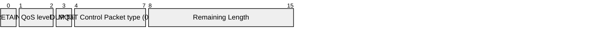
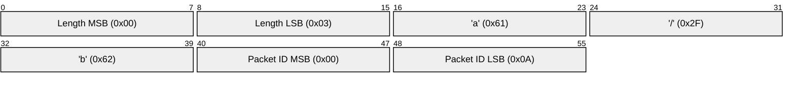

# 3.3 PUBLISH – Publish message

A PUBLISH Control Packet is sent from a Client to a Server or from Server to a Client to transport an Application Message.

### 3.3.1 Fixed header

Figure 3.10 – PUBLISH Packet fixed header illustrates the fixed header format:

##### Figure 3.10 – PUBLISH Packet fixed header

#### 3.3.1.1 DUP

**Position:** byte 1, bit 3.

If the DUP flag is set to 0, it indicates that this is the first occasion that the Client or Server has attempted to send this MQTT PUBLISH Packet. If the DUP flag is set to 1, it indicates that this might be re-delivery of an earlier attempt to send the Packet.

The DUP flag MUST be set to 1 by the Client or Server when it attempts to re-deliver a PUBLISH Packet \[MQTT-3.3.1.-1\]. The DUP flag MUST be set to 0 for all QoS 0 messages \[MQTT-3.3.1-2\].

The value of the DUP flag from an incoming PUBLISH packet is not propagated when the PUBLISH Packet is sent to subscribers by the Server. The DUP flag in the outgoing PUBLISH packet is set independently to the incoming PUBLISH packet, its value MUST be determined solely by whether the outgoing PUBLISH packet is a retransmission \[MQTT-3.3.1-3\].

**Non normative comment**

The recipient of a Control Packet that contains the DUP flag set to 1 cannot assume that it has seen an earlier copy of this packet.

**Non normative comment**

It is important to note that the DUP flag refers to the Control Packet itself and not to the Application Message that it contains. When using QoS 1, it is possible for a Client to receive a PUBLISH Packet with DUP flag set to 0 that contains a repetition of an Application Message that it received earlier, but with a different Packet Identifier. Section 2.3.1 provides more information about Packet Identifiers.

#### 3.3.1.2 QoS

**Position:** byte 1, bits 2-1.

This field indicates the level of assurance for delivery of an Application Message. The QoS levels are listed in the [Table 3.2 - QoS definitions](#_Table_3.11_-), below.

##### Table 3.2 - QoS definitions

| **QoS value** | **Bit 2** | **bit 1** | **Description**             |
| ------------- | --------- | --------- | --------------------------- |
| 0             | 0         | 0         | At most once delivery       |
| 1             | 0         | 1         | At least once delivery      |
| 2             | 1         | 0         | Exactly once delivery       |
| \-            | 1         | 1         | Reserved – must not be used |

A PUBLISH Packet MUST NOT have both QoS bits set to 1. If a Server or Client receives a PUBLISH Packet which has both QoS bits set to 1 it MUST close the Network Connection \[MQTT-3.3.1-4\].

#### 3.3.1.3 RETAIN

**Position:** byte 1, bit 0.

If the RETAIN flag is set to 1, in a PUBLISH Packet sent by a Client to a Server, the Server MUST store the Application Message and its QoS, so that it can be delivered to future subscribers whose subscriptions match its topic name \[MQTT-3.3.1-5\]. When a new subscription is established, the last retained message, if any, on each matching topic name MUST be sent to the subscriber \[MQTT-3.3.1-6\]. If the Server receives a QoS 0 message with the RETAIN flag set to 1 it MUST discard any message previously retained for that topic. It SHOULD store the new QoS 0 message as the new retained message for that topic, but MAY choose to discard it at any time - if this happens there will be no retained message for that topic \[MQTT-3.3.1-7\]. See Section 4.1 for more information on storing state.

When sending a PUBLISH Packet to a Client the Server MUST set the RETAIN flag to 1 if a message is sent as a result of a new subscription being made by a Client \[MQTT-3.3.1-8\]. It MUST set the RETAIN flag to 0 when a PUBLISH Packet is sent to a Client because it matches an established subscription regardless of how the flag was set in the message it received \[MQTT-3.3.1-9\].

A PUBLISH Packet with a RETAIN flag set to 1 and a payload containing zero bytes will be processed as normal by the Server and sent to Clients with a subscription matching the topic name. Additionally any existing retained message with the same topic name MUST be removed and any future subscribers for the topic will not receive a retained message \[MQTT-3.3.1-10\]. `As normal` means that the RETAIN flag is not set in the message received by existing Clients. A zero byte retained message MUST NOT be stored as a retained message on the Server \[MQTT-3.3.1-11\].

If the RETAIN flag is 0, in a PUBLISH Packet sent by a Client to a Server, the Server MUST NOT store the message and MUST NOT remove or replace any existing retained message \[MQTT-3.3.1-12\].

**Non normative comment**

Retained messages are useful where publishers send state messages on an irregular basis. A new subscriber will receive the most recent state.

**Remaining Length field**

This is the length of variable header plus the length of the payload.

### 3.3.2 Variable header

The variable header contains the following fields in the order: Topic Name, Packet Identifier.

#### 3.3.2.1 Topic Name

The Topic Name identifies the information channel to which payload data is published.

The Topic Name MUST be present as the first field in the PUBLISH Packet Variable header. It MUST be a UTF-8 encoded string \[MQTT-3.3.2-1\] as defined in section 1.5.3.

The Topic Name in the PUBLISH Packet MUST NOT contain wildcard characters \[MQTT-3.3.2-2\].

The Topic Name in a PUBLISH Packet sent by a Server to a subscribing Client MUST match the Subscription`s Topic Filter according to the matching process defined in Section 4.7 \[MQTT-3.3.2-3\]. However, since the Server is permitted to override the Topic Name, it might not be the same as the Topic Name in the original PUBLISH Packet.

#### 3.3.2.2 Packet Identifier

The Packet Identifier field is only present in PUBLISH Packets where the QoS level is 1 or 2. Section 2.3.1 provides more information about Packet Identifiers.

#### 3.3.2.3 Variable header non normative example

[Figure 3.11 - Publish Packet variable header non normative example](#_Figure_3.11_-) illustrates an example variable header for the PUBLISH Packet briefly described in [Table 3.3 - Publish Packet non normative example](#_Table_3.2_-).

##### Table 3.3 - Publish Packet non normative example

| **Field**         | **Value** |
| ----------------- | --------- |
| Topic Name        | a/b       |
| Packet Identifier | 10        |

##### Figure 3.11 - Publish Packet variable header non normative example

### 3.3.3 Payload

The Payload contains the Application Message that is being published. The content and format of the data is application specific. The length of the payload can be calculated by subtracting the length of the variable header from the Remaining Length field that is in the Fixed Header. It is valid for a PUBLISH Packet to contain a zero length payload.

### 3.3.4 Response

The receiver of a PUBLISH Packet MUST respond according to [Table 3.4 - Expected Publish Packet response](#_Table_3.3_-) as determined by the QoS in the PUBLISH Packet \[MQTT-3.3.4-1\].

##### Table 3.4 - Expected Publish Packet response

| **QoS Level** | **Expected Response** |
| ------------- | --------------------- |
| QoS 0         | None                  |
| QoS 1         | PUBACK Packet         |
| QoS 2         | PUBREC Packet         |

### 3.3.5 Actions

The Client uses a PUBLISH Packet to send an Application Message to the Server, for distribution to Clients with matching subscriptions.

The Server uses a PUBLISH Packet to send an Application Message to each Client which has a matching subscription.

When Clients make subscriptions with Topic Filters that include wildcards, it is possible for a Client`s subscriptions to overlap so that a published message might match multiple filters. In this case the Server MUST deliver the message to the Client respecting the maximum QoS of all the matching subscriptions \[MQTT-3.3.5-1\]. In addition, the Server MAY deliver further copies of the message, one for each additional matching subscription and respecting the subscription`s QoS in each case.

The action of the recipient when it receives a PUBLISH Packet depends on the QoS level as described in Section 4.3.

If a Server implementation does not authorize a PUBLISH to be performed by a Client; it has no way of informing that Client. It MUST either make a positive acknowledgement, according to the normal QoS rules, or close the Network Connection \[MQTT-3.3.5-2\].

