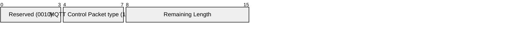
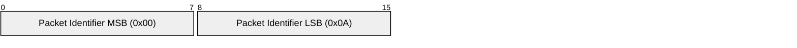
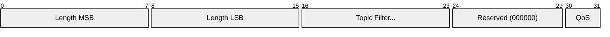
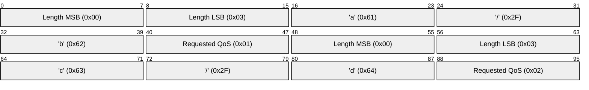

# 3.8 SUBSCRIBE - Subscribe to topics

The SUBSCRIBE Packet is sent from the Client to the Server to create one or more Subscriptions. Each Subscription registers a Client`s interest in one or more Topics. The Server sends PUBLISH Packets to the Client in order to forward Application Messages that were published to Topics that match these Subscriptions. The SUBSCRIBE Packet also specifies (for each Subscription) the maximum QoS with which the Server can send Application Messages to the Client.

### 3.8.1 Fixed header

##### Figure 3.20 – SUBSCRIBE Packet fixed header

Bits 3,2,1 and 0 of the fixed header of the SUBSCRIBE Control Packet are reserved and MUST be set to 0,0,1 and 0 respectively. The Server MUST treat any other value as malformed and close the Network Connection \[MQTT-3.8.1-1\].

**Remaining Length field**

This is the length of variable header (2 bytes) plus the length of the payload.

### 3.8.2 Variable header

The variable header contains a Packet Identifier. Section 2.3.1 provides more information about Packet Identifiers.

#### 3.8.2.1 Variable header non normative example

[Figure 3.21](#_Figure_3.21_-) shows a variable header with Packet Identifier set to 10.

##### Figure 3.21 - Variable header with a Packet Identifier of 10, Non normative example

### 3.8.3 Payload

The payload of a SUBSCRIBE Packet contains a list of Topic Filters indicating the Topics to which the Client wants to subscribe. The Topic Filters in a SUBSCRIBE packet payload MUST be UTF-8 encoded strings as defined in Section 1.5.3 \[MQTT-3.8.3-1\]. A Server SHOULD support Topic filters that contain the wildcard characters defined in Section [4.7.1](#_Topic_wildcards). If it chooses not to support topic filters that contain wildcard characters it MUST reject any Subscription request whose filter contains them \[MQTT-3.8.3-2\]. Each filter is followed by a byte called the Requested QoS. This gives the maximum QoS level at which the Server can send Application Messages to the Client.

The payload of a SUBSCRIBE packet MUST contain at least one Topic Filter / QoS pair. A SUBSCRIBE packet with no payload is a protocol violation \[MQTT-3.8.3-3\]. See section 4.8 for information about handling errors.

The requested maximum QoS field is encoded in the byte following each UTF-8 encoded topic name, and these Topic Filter / QoS pairs are packed contiguously.

##### Figure 3.22 – SUBSCRIBE Packet payload format

The upper 6 bits of the Requested QoS byte are not used in the current version of the protocol. They are reserved for future use. The Server MUST treat a SUBSCRIBE packet as malformed and close the Network Connection if any of Reserved bits in the payload are non-zero, or QoS is not 0,1 or 2 \[MQTT-3-8.3-4\].

#### 3.8.3.1 Payload non normative example

[Figure 3.23 - Payload byte format non normative example](#_Figure_3.23_-) shows the payload for the SUBSCRIBE Packet briefly described in [Table 3.5 - Payload non normative example](#_Table_3.4_-).

##### Table 3.5 - Payload non normative example

| **Field**     | **Value** |
| ------------- | --------- |
| Topic Name    | `a/b`     |
| Requested QoS | 0x01      |
| Topic Name    | `c/d`     |
| Requested QoS | 0x02      |

##### Figure 3.23 - Payload byte format non normative example

### 3.8.4 Response

When the Server receives a SUBSCRIBE Packet from a Client, the Server MUST respond with a SUBACK Packet \[MQTT-3.8.4-1\]. The SUBACK Packet MUST have the same Packet Identifier as the SUBSCRIBE Packet that it is acknowledging \[MQTT-3.8.4-2\].

The Server is permitted to start sending PUBLISH packets matching the Subscription before the Server sends the SUBACK Packet.

If a Server receives a SUBSCRIBE Packet containing a Topic Filter that is identical to an existing Subscription`s Topic Filter then it MUST completely replace that existing Subscription with a new Subscription. The Topic Filter in the new Subscription will be identical to that in the previous Subscription, although its maximum QoS value could be different. Any existing retained messages matching the Topic Filter MUST be re-sent, but the flow of publications MUST NOT be interrupted \[[MQTT-3](https://tools.oasis-open.org/issues/browse/MQTT-3 "Keep alive interval grace period.").8.4-3\].

Where the Topic Filter is not identical to any existing Subscription`s filter, a new Subscription is created and all matching retained messages are sent.

If a Server receives a SUBSCRIBE packet that contains multiple Topic Filters it MUST handle that packet as if it had received a sequence of multiple SUBSCRIBE packets, except that it combines their responses into a single SUBACK response \[MQTT-3.8.4-4\].

The SUBACK Packet sent by the Server to the Client MUST contain a return code for each Topic Filter/QoS pair. This return code MUST either show the maximum QoS that was granted for that Subscription or indicate that the subscription failed \[[MQTT-3](https://tools.oasis-open.org/issues/browse/MQTT-3 "Keep alive interval grace period.").8.4-5\]. The Server might grant a lower maximum QoS than the subscriber requested. The QoS of Payload Messages sent in response to a Subscription MUST be the minimum of the QoS of the originally published message and the maximum QoS granted by the Server. The server is permitted to send duplicate copies of a message to a subscriber in the case where the original message was published with QoS 1 and the maximum QoS granted was QoS 0 \[[MQTT-3](https://tools.oasis-open.org/issues/browse/MQTT-3 "Keep alive interval grace period.").8.4-6\].

**Non normative examples**

If a subscribing Client has been granted maximum QoS 1 for a particular Topic Filter, then a QoS 0 Application Message matching the filter is delivered to the Client at QoS 0. This means that at most one copy of the message is received by the Client. On the other hand a QoS 2 Message published to the same topic is downgraded by the Server to QoS 1 for delivery to the Client, so that Client might receive duplicate copies of the Message.

If the subscribing Client has been granted maximum QoS 0, then an Application Message originally published as QoS 2 might get lost on the hop to the Client, but the Server should never send a duplicate of that Message. A QoS 1 Message published to the same topic might either get lost or duplicated on its transmission to that Client.

**Non normative comment**

Subscribing to a Topic Filter at QoS 2 is equivalent to saying "I would like to receive Messages matching this filter at the QoS with which they were published". This means a publisher is responsible for determining the maximum QoS a Message can be delivered at, but a subscriber is able to require that the Server downgrades the QoS to one more suitable for its usage.

