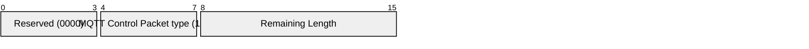
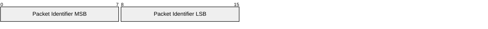
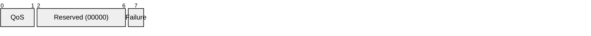
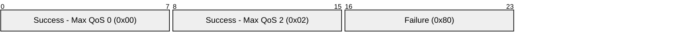

# 3.9 SUBACK – Subscribe acknowledgement

A SUBACK Packet is sent by the Server to the Client to confirm receipt and processing of a SUBSCRIBE Packet.

A SUBACK Packet contains a list of return codes, that specify the maximum QoS level that was granted in each Subscription that was requested by the SUBSCRIBE.

### 3.9.1 Fixed header

##### Figure 3.24 – SUBACK Packet fixed header

**Remaining Length field**

This is the length of variable header (2 bytes) plus the length of the payload.

### 3.9.2 Variable header

The variable header contains the Packet Identifier from the SUBSCRIBE Packet that is being acknowledged. [Figure 3.25 - variable header format](#_Figure_3.25_-) below illustrates the format of the variable header.

##### Figure 3.25 – SUBACK Packet variable header

### 3.9.3 Payload

The payload contains a list of return codes. Each return code corresponds to a Topic Filter in the SUBSCRIBE Packet being acknowledged. The order of return codes in the SUBACK Packet MUST match the order of Topic Filters in the SUBSCRIBE Packet \[MQTT-3.9.3-1\].

[Figure 3.26 - Payload format](#_Figure_3.26_-) below illustrates the Return Code field encoded in a byte in the Payload.

##### Figure 3.26 – SUBACK Packet payload format

Allowed return codes:

0x00 - Success - Maximum QoS 0
0x01 - Success - Maximum QoS 1
0x02 - Success - Maximum QoS 2
0x80 - Failure

SUBACK return codes other than 0x00, 0x01, 0x02 and 0x80 are reserved and MUST NOT be used \[MQTT-3.9.3-2\].

#### 3.9.3.1 Payload non normative example

[Figure 3.27 - Payload byte format non normative example](#_Figure_3.27_-) shows the payload for the SUBACK Packet briefly described in [Table 3.6 - Payload non normative example](#_Table_3.5_-).

##### Table 3.6 - Payload non normative example

| **Return Code**         | **Value** |
| ----------------------- | --------- |
| Success - Maximum QoS 0 | 0         |
| Success - Maximum QoS 2 | 2         |
| Failure                 | 128       |

##### Figure 3.27 - Payload byte format non normative example

