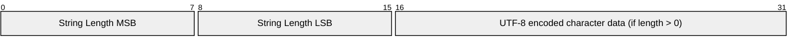
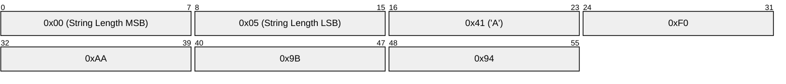

# 1.5 Data representation

## 1.5.1 Bits

Bits in a byte are labelled 7 to 0. Bit number 7 is the most significant bit, the least significant bit is assigned bit number 0.

## 1.5.2 Two Byte Integer

Two Byte Integer data values are 16-bit unsigned integers in big-endian order: the high order byte precedes the lower order byte. This means that a 16-bit word is presented on the network as Most Significant Byte (MSB), followed by Least Significant Byte (LSB).

## 1.5.3 Four Byte Integer

Four Byte Integer data values are 32-bit unsigned integers in big-endian order: the high order byte precedes the successively lower order bytes. This means that a 32-bit word is presented on the network as Most Significant Byte (MSB), followed by the next most Significant Byte (MSB), followed by the next most Significant Byte (MSB), followed by Least Significant Byte (LSB).

## 1.5.4 UTF-8 Encoded String

Text fields within the MQTT Control Packets described later are encoded as UTF-8 strings. UTF-8 [\[RFC3629\]](#RFC3629) is an efficient encoding of Unicode [\[Unicode\]](#Unicode) characters that optimizes the encoding of ASCII characters in support of text-based communications.

Each of these strings is prefixed with a Two Byte Integer length field that gives the number of bytes in a UTF-8 encoded string itself, as illustrated in Figure 1.1 Structure of UTF-8 Encoded Strings below. Consequently, the maximum size of a UTF-8 Encoded String is 65,535 bytes.

Unless stated otherwise all UTF-8 encoded strings can have any length in the range 0 to 65,535 bytes.

##### Figure 1-1 Structure of UTF-8 Encoded Strings



The character data in a UTF-8 Encoded String MUST be well-formed UTF-8 as defined by the Unicode specification [\[Unicode\]](#Unicode) and restated in RFC 3629 [\[RFC3629\]](#RFC3629). In particular, the character data MUST NOT include encodings of code points between U+D800 and U+DFFF \[MQTT-1.5.4-1\]. If the Client or Server receives an MQTT Control Packet containing ill-formed UTF-8 it is a Malformed Packet. Refer to [section 4.13](4.13_handling-errors.md) for information about handling errors.

A UTF-8 Encoded String MUST NOT include an encoding of the null character U+0000. \[MQTT-1.5.4-2\]. If a receiver (Server or Client) receives an MQTT Control Packet containing U+0000 it is a Malformed Packet. Refer to [section 4.13](4.13_handling-errors.md) for information about handling errors.

The data SHOULD NOT include encodings of the Unicode \[Unicode\] code points listed below. If a receiver (Server or Client) receives an MQTT Control Packet containing any of them it MAY treat it as a Malformed Packet. These are the Disallowed Unicode code points. Refer to [section 5.4.9](5.4_implementation-notes.md) for more information about handling Disallowed Unicode code points.

- U+0001..U+001F control characters
- U+007F..U+009F control characters
- Code points defined in the Unicode specification [\[Unicode\]](#Unicode) to be non-characters (for example U+0FFFF)

A UTF-8 encoded sequence 0xEF 0xBB 0xBF is always interpreted as U+FEFF ("ZERO WIDTH NO-BREAK SPACE") wherever it appears in a string and MUST NOT be skipped over or stripped off by a packet receiver \[MQTT-1.5.4-3\].

**Non-normative example**

For example, the string A 𪛔 which is LATIN CAPITAL Letter A followed by the code point U+2A6D4 (which represents a CJK IDEOGRAPH EXTENSION B character) is encoded as follows:

##### Figure 1-2 UTF-8 Encoded String non-normative example



## 1.5.5 Variable Byte Integer

The Variable Byte Integer is encoded using an encoding scheme which uses a single byte for values up to 127. Larger values are handled as follows. The least significant seven bits of each byte encode the data, and the most significant bit is used to indicate whether there are bytes following in the representation. Thus, each byte encodes 128 values and a "continuation bit". The maximum number of bytes in the Variable Byte Integer field is four. The encoded value MUST use the minimum number of bytes necessary to represent the value \[MQTT-1.5.5-1\]. This is shown in Table 1-1 Size of Variable Byte Integer.

##### Table 1-1 Size of Variable Byte Integer

| **Digits** | **From**                           | **To**                               |
| ---------- | ---------------------------------- | ------------------------------------ |
| 1          | 0 (0x00)                           | 127 (0x7F)                           |
| 2          | 128 (0x80, 0x01)                   | 16,383 (0xFF, 0x7F)                  |
| 3          | 16,384 (0x80, 0x80, 0x01)          | 2,097,151 (0xFF, 0xFF, 0x7F)         |
| 4          | 2,097,152 (0x80, 0x80, 0x80, 0x01) | 268,435,455 (0xFF, 0xFF, 0xFF, 0x7F) |

**Non-normative comment**

The algorithm for encoding a non-negative integer (X) into the Variable Byte Integer encoding scheme is as follows:

```js
do
  encodedByte = X MOD 128
  X = X DIV 128
  // if there are more data to encode, set the top bit of this byte
  if (X > 0) encodedByte = encodedByte OR 128
  'output' encodedByte
while (X > 0)
```

Where MOD is the modulo operator (% in C), DIV is integer division (/ in C), and OR is bit-wise or (| in C).

**Non-normative comment**

The algorithm for decoding a Variable Byte Integer type is as follows:

```js
multiplier = 1
value = 0
do
  encodedByte = 'next byte from stream'
  value += (encodedByte AND 127) * multiplier
  if (multiplier > 128*128*128) throw Error(Malformed Variable Byte Integer)
  multiplier *= 128
while ((encodedByte AND 128) != 0)
where AND is the bit-wise and operator (& in C).
```

When this algorithm terminates, value contains the Variable Byte Integer value.

## 1.5.6 Binary Data

Binary Data is represented by a Two Byte Integer length which indicates the number of data bytes, followed by that number of bytes. Thus, the length of Binary Data is limited to the range of 0 to 65,535 Bytes.

## 1.5.7 UTF-8 String Pair

A UTF-8 String Pair consists of two UTF-8 Encoded Strings. This data type is used to hold name-value pairs. The first string serves as the name, and the second string contains the value.

Both strings MUST comply with the requirements for UTF-8 Encoded Strings \[MQTT-1.5.7-1\]. If a receiver (Client or Server) receives a string pair which does not meet these requirements it is a Malformed Packet. Refer to [section 4.13](4.13_handling-errors.md) for information about handling errors.
