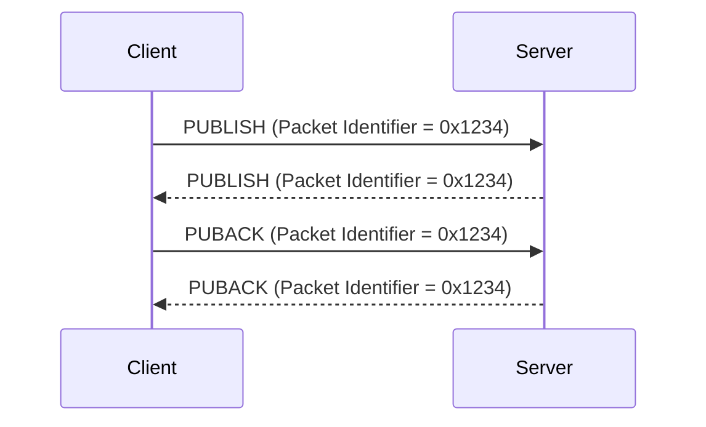

# 2.2 Variable Header

Some types of MQTT Control Packet contain a Variable Header component. It resides between the Fixed Header and the Payload. The content of the Variable Header varies depending on the packet type. The Packet Identifier field of Variable Header is common in several packet types.

## 2.2.1 Packet Identifier

The Variable Header component of many of the MQTT Control Packet types includes a Two Byte Integer Packet Identifier field. These MQTT Control Packets are PUBLISH (where QoS > 0), PUBACK, PUBREC, PUBREL, PUBCOMP, SUBSCRIBE, SUBACK, UNSUBSCRIBE, UNSUBACK.

MQTT Control Packets that require a Packet Identifier are shown below:

##### Table 2-3 MQTT Control Packets that contain a Packet Identifier

| **MQTT Control Packet** | **Packet Identifier field** |
| ----------------------- | --------------------------- |
| CONNECT                 | NO                          |
| CONNACK                 | NO                          |
| PUBLISH                 | YES (If QoS > 0)            |
| PUBACK                  | YES                         |
| PUBREC                  | YES                         |
| PUBREL                  | YES                         |
| PUBCOMP                 | YES                         |
| SUBSCRIBE               | YES                         |
| SUBACK                  | YES                         |
| UNSUBSCRIBE             | YES                         |
| UNSUBACK                | YES                         |
| PINGREQ                 | NO                          |
| PINGRESP                | NO                          |
| DISCONNECT              | NO                          |
| AUTH                    | NO                          |

A PUBLISH packet MUST NOT contain a Packet Identifier if its QoS value is set to 0 \[MQTT-2.2.1-2\].

Each time a Client sends a new SUBSCRIBE, UNSUBSCRIBE, or PUBLISH (where QoS > 0) MQTT Control Packet it MUST assign it a non-zero Packet Identifier that is currently unused \[MQTT-2.2.1-3\].

Each time a Server sends a new PUBLISH (with QoS > 0) MQTT Control Packet it MUST assign it a non zero Packet Identifier that is currently unused \[MQTT-2.2.1-4\].

The Packet Identifier becomes available for reuse after the sender has processed the corresponding acknowledgement packet, defined as follows. In the case of a QoS 1 PUBLISH, this is the corresponding PUBACK; in the case of QoS 2 PUBLISH it is PUBCOMP or a PUBREC with a Reason Code of 128 or greater. For SUBSCRIBE or UNSUBSCRIBE it is the corresponding SUBACK or UNSUBACK.

Packet Identifiers used with PUBLISH, SUBSCRIBE and UNSUBSCRIBE packets form a single, unified set of identifiers separately for the Client and the Server in a Session. A Packet Identifier cannot be used by more than one command at any time.

A PUBACK, PUBREC, PUBREL, or PUBCOMP packet MUST contain the same Packet Identifier as the PUBLISH packet that was originally sent \[MQTT-2.2.1-5\]. A SUBACK and UNSUBACK MUST contain the Packet Identifier that was used in the corresponding SUBSCRIBE and UNSUBSCRIBE packet respectively \[MQTT-2.2.1-6\].

The Client and Server assign Packet Identifiers independently of each other. As a result, Client-Server pairs can participate in concurrent message exchanges using the same Packet Identifiers.

**Non-normative comment**

It is possible for a Client to send a PUBLISH packet with Packet Identifier 0x1234 and then receive a different PUBLISH packet with Packet Identifier 0x1234 from its Server before it receives a PUBACK for the PUBLISH packet that it sent.

## 2.2.2 Properties

The last field in the Variable Header of the CONNECT, CONNACK, PUBLISH, PUBACK, PUBREC, PUBREL, PUBCOMP, SUBSCRIBE, SUBACK, UNSUBSCRIBE, UNSUBACK, DISCONNECT, and AUTH packet is a set of Properties. In the CONNECT packet there is also an optional set of Properties in the Will Properties field with the Payload.

The set of Properties is composed of a Property Length followed by the Properties.

### 2.2.2.1 Property Length

The Property Length is encoded as a Variable Byte Integer. The Property Length does not include the bytes used to encode itself, but includes the length of the Properties. If there are no properties, this MUST be indicated by including a Property Length of zero \[MQTT-2.2.2-1\].

### 2.2.2.2 Property

A Property consists of an Identifier which defines its usage and data type, followed by a value. The Identifier is encoded as a Variable Byte Integer. A Control Packet which contains an Identifier which is not valid for its packet type, or contains a value not of the specified data type, is a Malformed Packet. If received, use a CONNACK or DISCONNECT packet with Reason Code 0x81 (Malformed Packet) as described in [section 4.13](4.13_handling-errors.md) Handling errors. There is no significance in the order of Properties with different Identifiers.

##### Table 2-4 Properties

| **Dec** | **Hex** | **Name (usage)**                  | **Type**              | **Packet / Will Properties**                                                                                                            |
| ------- | ------- | --------------------------------- | --------------------- | --------------------------------------------------------------------------------------------------------------------------------------- |
| 1       | 0x01    | Payload Format Indicator          | Byte                  | PUBLISH, Will Properties                                                                                                                |
| 2       | 0x02    | Message Expiry Interval           | Four Byte Integer     | PUBLISH, Will Properties                                                                                                                |
| 3       | 0x03    | Content Type                      | UTF-8 Encoded String  | PUBLISH, Will Properties                                                                                                                |
| 8       | 0x08    | Response Topic                    | UTF-8 Encoded String  | PUBLISH, Will Properties                                                                                                                |
| 9       | 0x09    | Correlation Data                  | Binary Data           | PUBLISH, Will Properties                                                                                                                |
| 11      | 0x0B    | Subscription Identifier           | Variable Byte Integer | PUBLISH, SUBSCRIBE                                                                                                                      |
| 17      | 0x11    | Session Expiry Interval           | Four Byte Integer     | CONNECT, CONNACK, DISCONNECT                                                                                                            |
| 18      | 0x12    | Assigned Client Identifier        | UTF-8 Encoded String  | CONNACK                                                                                                                                 |
| 19      | 0x13    | Server Keep Alive                 | Two Byte Integer      | CONNACK                                                                                                                                 |
| 21      | 0x15    | Authentication Method             | UTF-8 Encoded String  | CONNECT, CONNACK, AUTH                                                                                                                  |
| 22      | 0x16    | Authentication Data               | Binary Data           | CONNECT, CONNACK, AUTH                                                                                                                  |
| 23      | 0x17    | Request Problem Information       | Byte                  | CONNECT                                                                                                                                 |
| 24      | 0x18    | Will Delay Interval               | Four Byte Integer     | Will Properties                                                                                                                         |
| 25      | 0x19    | Request Response Information      | Byte                  | CONNECT                                                                                                                                 |
| 26      | 0x1A    | Response Information              | UTF-8 Encoded String  | CONNACK                                                                                                                                 |
| 28      | 0x1C    | Server Reference                  | UTF-8 Encoded String  | CONNACK, DISCONNECT                                                                                                                     |
| 31      | 0x1F    | Reason String                     | UTF-8 Encoded String  | CONNACK, PUBACK, PUBREC, PUBREL, PUBCOMP, SUBACK, UNSUBACK, DISCONNECT, AUTH                                                            |
| 33      | 0x21    | Receive Maximum                   | Two Byte Integer      | CONNECT, CONNACK                                                                                                                        |
| 34      | 0x22    | Topic Alias Maximum               | Two Byte Integer      | CONNECT, CONNACK                                                                                                                        |
| 35      | 0x23    | Topic Alias                       | Two Byte Integer      | PUBLISH                                                                                                                                 |
| 36      | 0x24    | Maximum QoS                       | Byte                  | CONNACK                                                                                                                                 |
| 37      | 0x25    | Retain Available                  | Byte                  | CONNACK                                                                                                                                 |
| 38      | 0x26    | User Property                     | UTF-8 String Pair     | CONNECT, CONNACK, PUBLISH, Will Properties, PUBACK, PUBREC, PUBREL, PUBCOMP, SUBSCRIBE, SUBACK, UNSUBSCRIBE, UNSUBACK, DISCONNECT, AUTH |
| 39      | 0x27    | Maximum Packet Size               | Four Byte Integer     | CONNECT, CONNACK                                                                                                                        |
| 40      | 0x28    | Wildcard Subscription Available   | Byte                  | CONNACK                                                                                                                                 |
| 41      | 0x29    | Subscription Identifier Available | Byte                  | CONNACK                                                                                                                                 |
| 42      | 0x2A    | Shared Subscription Available     | Byte                  | CONNACK                                                                                                                                 |

**Non-normative comment**

Although the Property Identifier is defined as a Variable Byte Integer, in this version of the specification all of the Property Identifiers are one byte long.
