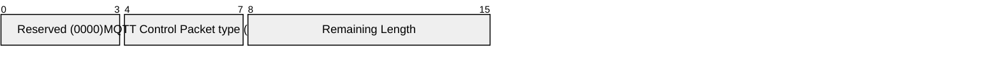

## 3.14 DISCONNECT – Disconnect notification

The DISCONNECT packet is the final MQTT Control Packet sent from the Client or the Server. It indicates the reason why the Network Connection is being closed. The Client or Server MAY send a DISCONNECT packet before closing the Network Connection. If the Network Connection is closed without the Client first sending a DISCONNECT packet with Reason Code 0x00 (Normal disconnection) and the Connection has a Will Message, the Will Message is published. Refer to [section 3.1.2.5](3.1_connect.md#3125-will-flag) for further details.

A Server MUST NOT send a DISCONNECT until after it has sent a CONNACK with Reason Code of less than 0x80 [MQTT-3.14.0-1].

### 3.14.1 DISCONNECT Fixed Header

Figure 3.35 – DISCONNECT packet Fixed Header

|         |                               |       |       |       |          |       |       |       |
| ------- | ----------------------------- | ----- | ----- | ----- | -------- | ----- | ----- | ----- |
| **Bit** | **7**                         | **6** | **5** | **4** | **3**    | **2** | **1** | **0** |
| byte 1  | MQTT Control Packet type (14) |       |       |       | Reserved |       |       |       |
|         | 1                             | 1     | 1     | 0     | 0        | 0     | 0     | 0     |
| byte 2  | Remaining Length              |       |       |       |          |       |       |       |

The Client or Server MUST validate that reserved bits are set to 0. If they are not zero it sends a DISCONNECT packet with a Reason code of 0x81 (Malformed Packet) as described in [section 4.13](4_operational-behavior.md#413-handling-errors) [MQTT-3.14.1-1].

**Remaining Length field**

This is the length of the Variable Header encoded as a Variable Byte Integer.

### 3.14.2 DISCONNECT Variable Header

The Variable Header of the DISCONNECT Packet contains the following fields in the order: Disconnect Reason Code, and Properties. The rules for encoding Properties are described in [section 2.2.2](2_mqtt-control-packet-format.md#222-properties).

#### 3.14.2.1 Disconnect Reason Code

Byte 1 in the Variable Header is the Disconnect Reason Code. If the Remaining Length is less than 1 the value of 0x00 (Normal disconnection) is used.

The values for the one byte unsigned Disconnect Reason Code field are shown below.

Table 3-10 – Disconnect Reason Code values

|           |         |                                        |                  |                                                                                                                                                                     |
| --------- | ------- | -------------------------------------- | ---------------- | ------------------------------------------------------------------------------------------------------------------------------------------------------------------- |
| **Value** | **Hex** | **Reason Code name**                   | **Sent by**      | **Description**                                                                                                                                                     |
| 0         | 0x00    | Normal disconnection                   | Client or Server | Close the connection normally. Do not send the Will Message.                                                                                                        |
| 4         | 0x04    | Disconnect with Will Message           | Client           | The Client wishes to disconnect but requires that the Server also publishes its Will Message.                                                                       |
| 128       | 0x80    | Unspecified error                      | Client or Server | The Connection is closed but the sender either does not wish to reveal the reason, or none of the other Reason Codes apply.                                         |
| 129       | 0x81    | Malformed Packet                       | Client or Server | The received packet does not conform to this specification.                                                                                                         |
| 130       | 0x82    | Protocol Error                         | Client or Server | An unexpected or out of order packet was received.                                                                                                                  |
| 131       | 0x83    | Implementation specific error          | Client or Server | The packet received is valid but cannot be processed by this implementation.                                                                                        |
| 135       | 0x87    | Not authorized                         | Server           | The request is not authorized.                                                                                                                                      |
| 137       | 0x89    | Server busy                            | Server           | The Server is busy and cannot continue processing requests from this Client.                                                                                        |
| 139       | 0x8B    | Server shutting down                   | Server           | The Server is shutting down.                                                                                                                                        |
| 141       | 0x8D    | Keep Alive timeout                     | Server           | The Connection is closed because no packet has been received for 1.5 times the Keepalive time.                                                                      |
| 142       | 0x8E    | Session taken over                     | Server           | Another Connection using the same ClientID has connected causing this Connection to be closed.                                                                      |
| 143       | 0x8F    | Topic Filter invalid                   | Server           | The Topic Filter is correctly formed, but is not accepted by this Sever.                                                                                            |
| 144       | 0x90    | Topic Name invalid                     | Client or Server | The Topic Name is correctly formed, but is not accepted by this Client or Server.                                                                                   |
| 147       | 0x93    | Receive Maximum exceeded               | Client or Server | The Client or Server has received more than Receive Maximum publication for which it has not sent PUBACK or PUBCOMP.                                                |
| 148       | 0x94    | Topic Alias invalid                    | Client or Server | The Client or Server has received a PUBLISH packet containing a Topic Alias which is greater than the Maximum Topic Alias it sent in the CONNECT or CONNACK packet. |
| 149       | 0x95    | Packet too large                       | Client or Server | The packet size is greater than Maximum Packet Size for this Client or Server.                                                                                      |
| 150       | 0x96    | Message rate too high                  | Client or Server | The received data rate is too high.                                                                                                                                 |
| 151       | 0x97    | Quota exceeded                         | Client or Server | An implementation or administrative imposed limit has been exceeded.                                                                                                |
| 152       | 0x98    | Administrative action                  | Client or Server | The Connection is closed due to an administrative action.                                                                                                           |
| 153       | 0x99    | Payload format invalid                 | Client or Server | The payload format does not match the one specified by the Payload Format Indicator.                                                                                |
| 154       | 0x9A    | Retain not supported                   | Server           | The Server has does not support retained messages.                                                                                                                  |
| 155       | 0x9B    | QoS not supported                      | Server           | The Client specified a QoS greater than the QoS specified in a Maximum QoS in the CONNACK.                                                                          |
| 156       | 0x9C    | Use another server                     | Server           | The Client should temporarily change its Server.                                                                                                                    |
| 157       | 0x9D    | Server moved                           | Server           | The Server is moved and the Client should permanently change its server location.                                                                                   |
| 158       | 0x9E    | Shared Subscriptions not supported     | Server           | The Server does not support Shared Subscriptions.                                                                                                                   |
| 159       | 0x9F    | Connection rate exceeded               | Server           | This connection is closed because the connection rate is too high.                                                                                                  |
| 160       | 0xA0    | Maximum connect time                   | Server           | The maximum connection time authorized for this connection has been exceeded.                                                                                       |
| 161       | 0xA1    | Subscription Identifiers not supported | Server           | The Server does not support Subscription Identifiers; the subscription is not accepted.                                                                             |
| 162       | 0xA2    | Wildcard Subscriptions not supported   | Server           | The Server does not support Wildcard Subscriptions; the subscription is not accepted.                                                                               |

The Client or Server sending the DISCONNECT packet MUST use one of the DISCONNECT Reason Code values [MQTT-3.14.2-1]. The Reason Code and Property Length can be omitted if the Reason Code is 0x00 (Normal disconnecton) and there are no Properties. In this case the DISCONNECT has a Remaining Length of 0.

**Non-normative comment**

The DISCONNECT packet is used to indicate the reason for a disconnect for cases where there is no acknowledge packet (such as a QoS 0 publish) or when the Client or Server is unable to continue processing the Connection.

**Non-normative comment**

The information can be used by the Client to decide whether to retry the connection, and how long it should wait before retrying the connection.

#### 3.14.2.2 DISCONNECT Properties

##### 3.14.2.2.1 Property Length

The length of Properties in the DISCONNECT packet Variable Header encoded as a Variable Byte Integer. If the Remaining Length is less than 2, a value of 0 is used.

##### 3.14.2.2.2 Session Expiry Interval

**17 (0x11) Byte,** Identifier of the Session Expiry Interval.

Followed by the Four Byte Integer representing the Session Expiry Interval in seconds. It is a Protocol Error to include the Session Expiry Interval more than once.

If the Session Expiry Interval is absent, the Session Expiry Interval in the CONNECT packet is used.

The Session Expiry Interval MUST NOT be sent on a DISCONNECT by the Server [MQTT-3.14.2-2].

If the Session Expiry Interval in the CONNECT packet was zero, then it is a Protocol Error to set a non-zero Session Expiry Interval in the DISCONNECT packet sent by the Client. If such a non-zero Session Expiry Interval is received by the Server, it does not treat it as a valid DISCONNECT packet. The Server uses DISCONNECT with Reason Code 0x82 (Protocol Error) as described in [section 4.13](4_operational-behavior.md#413-handling-errors).

##### 3.14.2.2.3 Reason String

**31 (0x1F) Byte,** Identifier of the Reason String.

Followed by the UTF-8 Encoded String representing the reason for the disconnect. This Reason String is human readable, designed for diagnostics and SHOULD NOT be parsed by the receiver.

The sender MUST NOT send this Property if it would increase the size of the DISCONNECT packet beyond the Maximum Packet Size specified by the receiver [MQTT-3.14.2-3]. It is a Protocol Error to include the Reason String more than once.

##### 3.14.2.2.4 User Property

**38 (0x26) Byte,** Identifier of the User Property.

Followed by UTF-8 String Pair. This property may be used to provide additional diagnostic or other information. The sender MUST NOT send this property if it would increase the size of the DISCONNECT packet beyond the Maximum Packet Size specified by the receiver [MQTT-3.14.2-4]. The User Property is allowed to appear multiple times to represent multiple name, value pairs. The same name is allowed to appear more than once.

##### 3.14.2.2.5 Server Reference

**28 (0x1C) Byte,** Identifier of the Server Reference.

Followed by a UTF-8 Encoded String which can be used by the Client to identify another Server to use. It is a Protocol Error to include the Server Reference more than once.

The Server sends DISCONNECT including a Server Reference and Reason Code 0x9C (Use another server) or 0x9D (Server moved) as described in [section 4.13](4_operational-behavior.md#413-handling-errors).

Refer to [section 4.11](4_operational-behavior.md#411-server-redirection) Server Redirection for information about how Server Reference is used.

Figure 3-24 DISCONNECT packet Variable Header non-normative example

|                        |                                         |       |     |       |       |     |       |     |       |     |       |     |       |     |       |     |
| ---------------------- | --------------------------------------- | ----- | --- | ----- | ----- | --- | ----- | --- | ----- | --- | ----- | --- | ----- | --- | ----- | --- |
|                        | **Description**                         | **7** |     | **6** | **5** |     | **4** |     | **3** |     | **2** |     | **1** |     | **0** |     |
| Disconnect Reason Code |                                         |       |     |       |       |     |       |     |       |     |       |     |       |     |       |     |
| byte 1                 |                                         | 0     |     | 0     | 0     |     | 0     |     | 0     |     | 0     |     | 0     |     | 0     |     |
| Properties             |                                         |       |     |       |       |     |       |     |       |     |       |     |       |     |       |     |
| byte 2                 | Length (5)                              |       | 0   | 0     |       | 0   |       | 0   |       | 0   |       | 1   |       | 1   |       | 1   |
| byte 3                 | Session Expiry Interval identifier (17) |       | 0   | 0     |       | 0   |       | 1   |       | 0   |       | 0   |       | 0   |       | 1   |
| byte 4                 | Session Expiry Interval (0)             |       | 0   | 0     |       | 0   |       | 0   |       | 0   |       | 0   |       | 0   |       | 0   |
| byte 5                 | 0                                       | 0     |     | 0     |       | 0   | 0     |     | 0     |     |       | 0   | 0     |     |
| byte 6                 | 0                                       | 0     |     | 0     |       | 0   | 0     |     | 0     |     |       | 0   | 0     |     |
| byte 7                 | 0                                       | 0     |     | 0     |       | 0   | 0     |     | 0     |     |       | 0   | 0     |     |
|                        |                                         |       |     |       |       |     |       |     |       |     |       |     |       |     |       |     |

### 3.14.3 DISCONNECT Payload

The DISCONNECT packet has no Payload.

### 3.14.4 DISCONNECT Actions

After sending a DISCONNECT packet the sender:

- MUST NOT send any more MQTT Control Packets on that Network Connection [MQTT-3.14.4-1].
- MUST close the Network Connection [MQTT-3.14.4-2].

On receipt of DISCONNECT with a Reason Code of 0x00 (Success) the Server:

- MUST discard any Will Message associated with the current Connection without publishing it [MQTT-3.14.4-3], as described in [section 3.1.2.5](3.1_connect.md#3125-will-flag).

On receipt of DISCONNECT, the receiver:

- SHOULD close the Network Connection.
