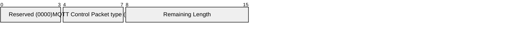

## 3.15 AUTH – Authentication exchange

An AUTH packet is sent from Client to Server or Server to Client as part of an extended authentication exchange, such as challenge / response authentication. It is a Protocol Error for the Client or Server to send an AUTH packet if the CONNECT packet did not contain the same Authentication Method.

### 3.15.1 AUTH Fixed Header

Figure 3.35 – AUTH packet Fixed Header

|         |                               |       |       |       |          |       |       |       |
| ------- | ----------------------------- | ----- | ----- | ----- | -------- | ----- | ----- | ----- |
| **Bit** | **7**                         | **6** | **5** | **4** | **3**    | **2** | **1** | **0** |
| byte 1  | MQTT Control Packet type (15) |       |       |       | Reserved |       |       |       |
|         | 1                             | 1     | 1     | 1     | 0        | 0     | 0     | 0     |
| byte 2  | Remaining Length              |       |       |       |          |       |       |       |

Bits 3,2,1 and 0 of the Fixed Header of the AUTH packet are reserved and MUST all be set to 0. The Client or Server MUST treat any other value as malformed and close the Network Connection [MQTT-3.15.1-1].

**Remaining Length field**

This is the length of the Variable Header encoded as a Variable Byte Integer.

### 3.15.2 AUTH Variable Header

The Variable Header of the AUTH Packet contains the following fields in the order: Authenticate Reason Code, and Properties. The rules for encoding Properties are described in [section 2.2.2](2_mqtt-control-packet-format.md#222-properties).

#### 3.15.2.1 Authenticate Reason Code

Byte 0 in the Variable Header is the Authenticate Reason Code. The values for the one byte unsigned Authenticate Reason Code field are shown below. The sender of the AUTH Packet MUST use one of the Authenticate Reason Codes [MQTT-3.15.2-1].

Table 3-11 Authenticate Reason Codes

|           |         |                         |                  |                                               |
| --------- | ------- | ----------------------- | ---------------- | --------------------------------------------- |
| **Value** | **Hex** | **Reason Code name**    | **Sent by**      | **Description**                               |
| 0         | 0x00    | Success                 | Server           | Authentication is successful                  |
| 24        | 0x18    | Continue authentication | Client or Server | Continue the authentication with another step |
| 25        | 0x19    | Re-authenticate         | Client           | Initiate a re-authentication                  |

The Reason Code and Property Length can be omitted if the Reason Code is 0x00 (Success) and there are no Properties. In this case the AUTH has a Remaining Length of 0.

#### 3.15.2.2 AUTH Properties

##### 3.15.2.2.1 Property Length

The length of Properties in the AUTH packet Variable Header encoded as a Variable Byte Integer.

##### 3.15.2.2.2 Authentication Method

**21 (0x15) Byte**, Identifier of the Authentication Method.

Followed by a UTF-8 Encoded String containing the name of the authentication method. It is a Protocol Error to omit the Authentication Method or to include it more than once. Refer to [section 4.12](4_operational-behavior.md#412-enhanced-authentication) for more information about extended authentication.

##### 3.15.2.2.3 Authentication Data

**22 (0x16) Byte**, Identifier of the Authentication Data.

Followed by Binary Data containing authentication data. It is a Protocol Error to include Authentication Data more than once. The contents of this data are defined by the authentication method. Refer to [section 4.12](4_operational-behavior.md#412-enhanced-authentication) for more information about extended authentication.

##### 3.15.2.2.4 Reason String

**31 (0x1F) Byte,** Identifier of the Reason String.

Followed by the UTF-8 Encoded String representing the reason for the disconnect. This Reason String is human readable, designed for diagnostics and SHOULD NOT be parsed by the receiver.

The sender MUST NOT send this property if it would increase the size of the AUTH packet beyond the Maximum Packet Size specified by the receiver [MQTT-3.15.2-2]. It is a Protocol Error to include the Reason String more than once.

##### 3.15.2.2.5 User Property

**38 (0x26) Byte,** Identifier of the User Property.

Followed by UTF-8 String Pair. This property may be used to provide additional diagnostic or other information. The sender MUST NOT send this property if it would increase the size of the AUTH packet beyond the Maximum Packet Size specified by the receiver [MQTT-3.15.2-3]. The User Property is allowed to appear multiple times to represent multiple name, value pairs. The same name is allowed to appear more than once.

### 3.15.3 AUTH Payload

The AUTH packet has no Payload.

### 3.15.4 AUTH Actions

Refer to [section 4.12](4_operational-behavior.md#412-enhanced-authentication) for more information about extended authentication.
