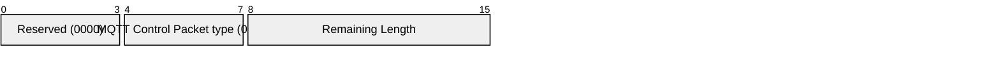

# 3.2 CONNACK – Connect acknowledgement

The CONNACK packet is the packet sent by the Server in response to a CONNECT packet received from a Client. The Server MUST send a CONNACK with a 0x00 (Success) Reason Code before sending any Packet other than AUTH \[MQTT-3.2.0-1\]. The Server MUST NOT send more than one CONNACK in a Network Connection \[MQTT-3.2.0-2\].

If the Client does not receive a CONNACK packet from the Server within a reasonable amount of time, the Client SHOULD close the Network Connection. A "reasonable" amount of time depends on the type of application and the communications infrastructure.

## 3.2.1 CONNACK Fixed Header

##### Figure 3-7 CONNACK packet Fixed Header

**Remaining Length field**

This is the length of the Variable Header encoded as a Variable Byte Integer.

## 3.2.2 CONNACK Variable Header

The Variable Header of the CONNACK Packet contains the following fields in the order: Connect Acknowledge Flags, Connect Reason Code, and Properties. The rules for encoding Properties are described in [section 2.2.2](2.2_variable-header.md#222-properties).

### 3.2.2.1 Connect Acknowledge Flags

Byte 1 is the "Connect Acknowledge Flags". Bits 7-1 are reserved and MUST be set to 0 \[MQTT-3.2.2-1\].

Bit 0 is the Session Present Flag.

#### 3.2.2.1.1 Session Present

Position: bit 0 of the Connect Acknowledge Flags.

The Session Present flag informs the Client whether the Server is using Session State from a previous connection for this ClientID. This allows the Client and Server to have a consistent view of the Session State.

If the Server accepts a connection with Clean Start set to 1, the Server MUST set Session Present to 0 in the CONNACK packet in addition to setting a 0x00 (Success) Reason Code in the CONNACK packet \[MQTT-3.2.2-2\].

If the Server accepts a connection with Clean Start set to 0 and the Server has Session State for the ClientID, it MUST set Session Present to 1 in the CONNACK packet, otherwise it MUST set Session Present to 0 in the CONNACK packet. In both cases it MUST set a 0x00 (Success) Reason Code in the CONNACK packet \[MQTT-3.2.2-3\].

If the value of Session Present received by the Client from the Server is not as expected, the Client proceeds as follows:

- If the Client does not have Session State and receives Session Present set to 1 it MUST close the Network Connection \[MQTT-3.2.2-4\]. If it wishes to restart with a new Session the Client can reconnect using Clean Start set to 1.

- If the Client does have Session State and receives Session Present set to 0 it MUST discard its Session State if it continues with the Network Connection \[MQTT-3.2.2-5\].

If a Server sends a CONNACK packet containing a non-zero Reason Code it MUST set Session Present to 0 \[MQTT-3.2.2-6\].

### 3.2.2.2 Connect Reason Code

Byte 2 in the Variable Header is the Connect Reason Code.

The values the Connect Reason Code are shown below. If a well formed CONNECT packet is received by the Server, but the Server is unable to complete the Connection the Server MAY send a CONNACK packet containing the appropriate Connect Reason code from this table. If a Server sends a CONNACK packet containing a Reason code of 128 or greater it MUST then close the Network Connection \[MQTT-3.2.2-7\].

##### Table 3-1 Connect Reason Code values

| **Value** | **Hex** | **Reason Code name**          | **Description**                                                                                          |
| --------- | ------- | ----------------------------- | -------------------------------------------------------------------------------------------------------- |
| 0         | 0x00    | Success                       | The Connection is accepted.                                                                              |
| 128       | 0x80    | Unspecified error             | The Server does not wish to reveal the reason for the failure, or none of the other Reason Codes apply.  |
| 129       | 0x81    | Malformed Packet              | Data within the CONNECT packet could not be correctly parsed.                                            |
| 130       | 0x82    | Protocol Error                | Data in the CONNECT packet does not conform to this specification.                                       |
| 131       | 0x83    | Implementation specific error | The CONNECT is valid but is not accepted by this Server.                                                 |
| 132       | 0x84    | Unsupported Protocol Version  | The Server does not support the version of the MQTT protocol requested by the Client.                    |
| 133       | 0x85    | Client Identifier not valid   | The Client Identifier is a valid string but is not allowed by the Server.                                |
| 134       | 0x86    | Bad User Name or Password     | The Server does not accept the User Name or Password specified by the Client                             |
| 135       | 0x87    | Not authorized                | The Client is not authorized to connect.                                                                 |
| 136       | 0x88    | Server unavailable            | The MQTT Server is not available.                                                                        |
| 137       | 0x89    | Server busy                   | The Server is busy. Try again later.                                                                     |
| 138       | 0x8A    | Banned                        | This Client has been banned by administrative action. Contact the server administrator.                  |
| 140       | 0x8C    | Bad authentication method     | The authentication method is not supported or does not match the authentication method currently in use. |
| 144       | 0x90    | Topic Name invalid            | The Will Topic Name is not malformed, but is not accepted by this Server.                                |
| 149       | 0x95    | Packet too large              | The CONNECT packet exceeded the maximum permissible size.                                                |
| 151       | 0x97    | Quota exceeded                | An implementation or administrative imposed limit has been exceeded.                                     |
| 153       | 0x99    | Payload format invalid        | The Will Payload does not match the specified Payload Format Indicator.                                  |
| 154       | 0x9A    | Retain not supported          | The Server does not support retained messages, and Will Retain was set to 1.                             |
| 155       | 0x9B    | QoS not supported             | The Server does not support the QoS set in Will QoS.                                                     |
| 156       | 0x9C    | Use another server            | The Client should temporarily use another server.                                                        |
| 157       | 0x9D    | Server moved                  | The Client should permanently use another server.                                                        |
| 159       | 0x9F    | Connection rate exceeded      | The connection rate limit has been exceeded.                                                             |

The Server sending the CONNACK packet MUST use one of the Connect Reason Code values \[MQTT-3.2.2-8\].

**Non-normative comment**

Reason Code 0x80 (Unspecified error) may be used where the Server knows the reason for the failure but does not wish to reveal it to the Client, or when none of the other Reason Code values applies.

The Server may choose to close the Network Connection without sending a CONNACK to enhance security in the case where an error is found on the CONNECT. For instance, when on a public network and the connection has not been authorized it might be unwise to indicate that this is an MQTT Server.

### 3.2.2.3 CONNACK Properties

#### 3.2.2.3.1 Property Length

This is the length of the Properties in the CONNACK packet Variable Header encoded as a Variable Byte Integer.

#### 3.2.2.3.2 Session Expiry Interval

**17 (0x11) Byte,** Identifier of the Session Expiry Interval.

Followed by the Four Byte Integer representing the Session Expiry Interval in seconds. It is a Protocol Error to include the Session Expiry Interval more than once.

If the Session Expiry Interval is absent the value in the CONNECT Packet used. The server uses this property to inform the Client that it is using a value other than that sent by the Client in the CONNACK. Refer to [section 3.1.2.11.2](3.1_connect.md#312112-session-expiry-interval) for a description of the use of Session Expiry Interval.

#### 3.2.2.3.3 Receive Maximum

**33 (0x21) Byte,** Identifier of the Receive Maximum.

Followed by the Two Byte Integer representing the Receive Maximum value. It is a Protocol Error to include the Receive Maximum value more than once or for it to have the value 0.

The Server uses this value to limit the number of QoS 1 and QoS 2 publications that it is willing to process concurrently for the Client. It does not provide a mechanism to limit the QoS 0 publications that the Client might try to send.

If the Receive Maximum value is absent, then its value defaults to 65,535.

Refer to [section 4.9](4.9_flow-control.md) Flow Control for details of how the Receive Maximum is used.

#### 3.2.2.3.4 Maximum QoS

**36 (0x24) Byte,** Identifier of the Maximum QoS.

Followed by a Byte with a value of either 0 or 1. It is a Protocol Error to include Maximum QoS more than once, or to have a value other than 0 or 1. If the Maximum QoS is absent, the Client uses a Maximum QoS of 2.

If a Server does not support QoS 1 or QoS 2 PUBLISH packets it MUST send a Maximum QoS in the CONNACK packet specifying the highest QoS it supports \[MQTT-3.2.2-9\]. A Server that does not support QoS 1 or QoS 2 PUBLISH packets MUST still accept SUBSCRIBE packets containing a Requested QoS of 0, 1 or 2 \[MQTT-3.2.2-10\].

If a Client receives a Maximum QoS from a Server, it MUST NOT send PUBLISH packets at a QoS level exceeding the Maximum QoS level specified \[MQTT-3.2.2-11\]. It is a Protocol Error if the Server receives a PUBLISH packet with a QoS greater than the Maximum QoS it specified. In this case use DISCONNECT with Reason Code 0x9B (QoS not supported) as described in [section 4.13](4.13_handling-errors.md) Handling errors.

If a Server receives a CONNECT packet containing a Will QoS that exceeds its capabilities, it MUST reject the connection. It SHOULD use a CONNACK packet with Reason Code 0x9B (QoS not supported) as described in [section 4.13](4.13_handling-errors.md) Handling errors, and MUST close the Network Connection \[MQTT-3.2.2-12\].

**Non-normative comment**

A Client does not need to support QoS 1 or QoS 2 PUBLISH packets. If this is the case, the Client simply restricts the maximum QoS field in any SUBSCRIBE commands it sends to a value it can support.

#### 3.2.2.3.5 Retain Available

**37 (0x25) Byte**, Identifier of Retain Available.

Followed by a Byte field. If present, this byte declares whether the Server supports retained messages. A value of 0 means that retained messages are not supported. A value of 1 means retained messages are supported. If not present, then retained messages are supported. It is a Protocol Error to include Retain Available more than once or to use a value other than 0 or 1.

If a Server receives a CONNECT packet containing a Will Message with the Will Retain set to 1, and it does not support retained messages, the Server MUST reject the connection request. It SHOULD send CONNACK with Reason Code 0x9A (Retain not supported) and then it MUST close the Network Connection \[MQTT-3.2.2-13\].

A Client receiving Retain Available set to 0 from the Server MUST NOT send a PUBLISH packet with the RETAIN flag set to 1 \[MQTT-3.2.2-14\]. If the Server receives such a packet, this is a Protocol Error. The Server SHOULD send a DISCONNECT with Reason Code of 0x9A (Retain not supported) as described in [section 4.13](4.13_handling-errors.md).

#### 3.2.2.3.6 Maximum Packet Size

**39 (0x27) Byte**, Identifier of the Maximum Packet Size.

Followed by a Four Byte Integer representing the Maximum Packet Size the Server is willing to accept. If the Maximum Packet Size is not present, there is no limit on the packet size imposed beyond the limitations in the protocol as a result of the remaining length encoding and the protocol header sizes.

It is a Protocol Error to include the Maximum Packet Size more than once, or for the value to be set to zero.

The packet size is the total number of bytes in an MQTT Control Packet, as defined in [section 2.1.4](2.1_structure.md#214-remaining-length). The Server uses the Maximum Packet Size to inform the Client that it will not process packets whose size exceeds this limit.

The Client MUST NOT send packets exceeding Maximum Packet Size to the Server \[MQTT-3.2.2-15\]. If a Server receives a packet whose size exceeds this limit, this is a Protocol Error, the Server uses DISCONNECT with Reason Code 0x95 (Packet too large), as described in [section 4.13](4.13_handling-errors.md).

#### 3.2.2.3.7 Assigned Client Identifier

**18 (0x12) Byte**, Identifier of the Assigned Client Identifier.

Followed by the UTF-8 string which is the Assigned Client Identifier. It is a Protocol Error to include the Assigned Client Identifier more than once.

The Client Identifier which was assigned by the Server because a zero length Client Identifier was found in the CONNECT packet.

If the Client connects using a zero length Client Identifier, the Server MUST respond with a CONNACK containing an Assigned Client Identifier. The Assigned Client Identifier MUST be a new Client Identifier not used by any other Session currently in the Server \[MQTT-3.2.2-16\].

#### 3.2.2.3.8 Topic Alias Maximum

**34 (0x22) Byte**, Identifier of the Topic Alias Maximum.

Followed by the Two Byte Integer representing the Topic Alias Maximum value. It is a Protocol Error to include the Topic Alias Maximum value more than once. If the Topic Alias Maximum property is absent, the default value is 0.

This value indicates the highest value that the Server will accept as a Topic Alias sent by the Client. The Server uses this value to limit the number of Topic Aliases that it is willing to hold on this Connection. The Client MUST NOT send a Topic Alias in a PUBLISH packet to the Server greater than this value \[MQTT-3.2.2-17\]. A value of 0 indicates that the Server does not accept any Topic Aliases on this connection. If Topic Alias Maximum is absent or 0, the Client MUST NOT send any Topic Aliases on to the Server \[MQTT-3.2.2-18\].

#### 3.2.2.3.9 Reason String

**31 (0x1F) Byte** Identifier of the Reason String.

Followed by the UTF-8 Encoded String representing the reason associated with this response. This Reason String is a human readable string designed for diagnostics and SHOULD NOT be parsed by the Client.

The Server uses this value to give additional information to the Client. The Server MUST NOT send this property if it would increase the size of the CONNACK packet beyond the Maximum Packet Size specified by the Client \[MQTT-3.2.2-19\]. It is a Protocol Error to include the Reason String more than once.

**Non-normative comment**

Proper uses for the reason string in the Client would include using this information in an exception thrown by the Client code, or writing this string to a log.

#### 3.2.2.3.10 User Property

**38 (0x26) Byte,** Identifier of User Property.

Followed by a UTF-8 String Pair. This property can be used to provide additional information to the Client including diagnostic information. The Server MUST NOT send this property if it would increase the size of the CONNACK packet beyond the Maximum Packet Size specified by the Client \[MQTT-3.2.2-20\]. The User Property is allowed to appear multiple times to represent multiple name, value pairs. The same name is allowed to appear more than once.

The content and meaning of this property is not defined by this specification. The receiver of a CONNACK containing this property MAY ignore it.

#### 3.2.2.3.11 Wildcard Subscription Available

**40 (0x28) Byte,** Identifier of Wildcard Subscription Available.

Followed by a Byte field. If present, this byte declares whether the Server supports Wildcard Subscriptions. A value is 0 means that Wildcard Subscriptions are not supported. A value of 1 means Wildcard Subscriptions are supported. If not present, then Wildcard Subscriptions are supported. It is a Protocol Error to include the Wildcard Subscription Available more than once or to send a value other than 0 or 1.

If the Server receives a SUBSCRIBE packet containing a Wildcard Subscription and it does not support Wildcard Subscriptions, this is a Protocol Error. The Server uses DISCONNECT with Reason Code 0xA2 (Wildcard Subscriptions not supported) as described in [section 4.13](4.13_handling-errors.md).

If a Server supports Wildcard Subscriptions, it can still reject a particular subscribe request containing a Wildcard Subscription. In this case the Server MAY send a SUBACK Control Packet with a Reason Code 0xA2 (Wildcard Subscriptions not supported).

#### 3.2.2.3.12 Subscription Identifiers Available

**41 (0x29) Byte**, Identifier of Subscription Identifier Available.

Followed by a Byte field. If present, this byte declares whether the Server supports Subscription Identifiers. A value is 0 means that Subscription Identifiers are not supported. A value of 1 means Subscription Identifiers are supported. If not present, then Subscription Identifiers are supported. It is a Protocol Error to include the Subscription Identifier Available more than once, or to send a value other than 0 or 1.

If the Server receives a SUBSCRIBE packet containing Subscription Identifier and it does not support Subscription Identifiers, this is a Protocol Error. The Server uses DISCONNECT with Reason Code of 0xA1 (Subscription Identifiers not supported) as described in [section 4.13](4.13_handling-errors.md).

#### 3.2.2.3.13 Shared Subscription Available

**42 (0x2A) Byte**, Identifier of Shared Subscription Available.

Followed by a Byte field. If present, this byte declares whether the Server supports Shared Subscriptions. A value is 0 means that Shared Subscriptions are not supported. A value of 1 means Shared Subscriptions are supported. If not present, then Shared Subscriptions are supported. It is a Protocol Error to include the Shared Subscription Available more than once or to send a value other than 0 or 1.

If the Server receives a SUBSCRIBE packet containing Shared Subscriptions and it does not support Shared Subscriptions, this is a Protocol Error. The Server uses DISCONNECT with Reason Code 0x9E (Shared Subscriptions not supported) as described in [section 4.13](4.13_handling-errors.md).

#### 3.2.2.3.14 Server Keep Alive

**19 (0x13) Byte**, Identifier of the Server Keep Alive.

Followed by a Two Byte Integer with the Keep Alive time assigned by the Server. If the Server sends a Server Keep Alive on the CONNACK packet, the Client MUST use this value instead of the Keep Alive value the Client sent on CONNECT \[MQTT-3.2.2-21\]. If the Server does not send the Server Keep Alive, the Server MUST use the Keep Alive value set by the Client on CONNECT \[MQTT-3.2.2-22\]. It is a Protocol Error to include the Server Keep Alive more than once.

**Non-normative comment**

The primary use of the Server Keep Alive is for the Server to inform the Client that it will disconnect the Client for inactivity sooner than the Keep Alive specified by the Client.

#### 3.2.2.3.15 Response Information

**26 (0x1A) Byte**, Identifier of the Response Information.

Followed by a UTF-8 Encoded String which is used as the basis for creating a Response Topic. The way in which the Client creates a Response Topic from the Response Information is not defined by this specification. It is a Protocol Error to include the Response Information more than once.

If the Client sends a Request Response Information with a value 1, it is OPTIONAL for the Server to send the Response Information in the CONNACK.

**Non-normative comment**

A common use of this is to pass a globally unique portion of the topic tree which is reserved for this Client for at least the lifetime of its Session. This often cannot just be a random name as both the requesting Client and the responding Client need to be authorized to use it. It is normal to use this as the root of a topic tree for a particular Client. For the Server to return this information, it normally needs to be correctly configured. Using this mechanism allows this configuration to be done once in the Server rather than in each Client.

Refer to [section 4.10](4.10_request-response.md) for more information about Request / Response.

#### 3.2.2.3.16 Server Reference

**28 (0x1C) Byte**, Identifier of the Server Reference.

Followed by a UTF-8 Encoded String which can be used by the Client to identify another Server to use. It is a Protocol Error to include the Server Reference more than once.

The Server uses a Server Reference in either a CONNACK or DISCONNECT packet with Reason code of 0x9C (Use another server) or Reason Code 0x9D (Server moved) as described in [section 4.13](4.13_handling-errors.md).

Refer to [section 4.11](4.11_server-redirection.md) Server redirection for information about how Server Reference is used.

#### 3.2.2.3.17 Authentication Method

**21 (0x15) Byte,** Identifier of the Authentication Method.

Followed by a UTF-8 Encoded String containing the name of the authentication method. It is a Protocol Error to include the Authentication Method more than once. Refer to [section 4.12](4.12_enhanced-authentication.md) for more information about extended authentication.

#### 3.2.2.3.18 Authentication Data

**22 (0x16) Byte,** Identifier of the Authentication Data.

Followed by Binary Data containing authentication data. The contents of this data are defined by the authentication method and the state of already exchanged authentication data. It is a Protocol Error to include the Authentication Data more than once. Refer to [section 4.12](4.12_enhanced-authentication.md) for more information about extended authentication.

## 3.2.3 CONNACK Payload

The CONNACK packet has no Payload.
