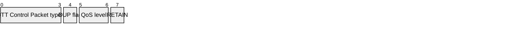

## 3.3 PUBLISH – Publish message

A PUBLISH packet is sent from a Client to a Server or from a Server to a Client to transport an Application Message.

### 3.3.1 PUBLISH Fixed Header

Figure 3‑8 – PUBLISH packet Fixed Header

Byte 1:
- Bits 7-4: `0011` (MQTT Control Packet type 3)
- Bit 3: DUP flag (X)
- Bits 2-1: QoS level (XX)
- Bit 0: RETAIN (X)

Byte 2…: Remaining Length

#### 3.3.1.1 DUP

**Position:** byte 1, bit 3.

If the DUP flag is set to 0, it indicates that this is the first occasion that the Client or Server has attempted to send this PUBLISH packet. If the DUP flag is set to 1, it indicates that this might be re-delivery of an earlier attempt to send the packet.

The DUP flag MUST be set to 1 by the Client or Server when it attempts to re-deliver a PUBLISH packet \[MQTT-3.3.1-1\]. The DUP flag MUST be set to 0 for all QoS 0 messages \[MQTT-3.3.1-2\].

The value of the DUP flag from an incoming PUBLISH packet is not propagated when the PUBLISH packet is sent to subscribers by the Server. The DUP flag in the outgoing PUBLISH packet is set independently to the incoming PUBLISH packet, its value MUST be determined solely by whether the outgoing PUBLISH packet is a retransmission \[MQTT-3.3.1-3\].

**Non-normative comment**

The receiver of an MQTT Control Packet that contains the DUP flag set to 1 cannot assume that it has seen an earlier copy of this packet.

**Non-normative comment**

It is important to note that the DUP flag refers to the MQTT Control Packet itself and not to the Application Message that it contains. When using QoS 1, it is possible for a Client to receive a PUBLISH packet with DUP flag set to 0 that contains a repetition of an Application Message that it received earlier, but with a different Packet Identifier. [Section 2.2.1](2.2_variable-header.md#221-packet-identifier) provides more information about Packet Identifiers.

#### 3.3.1.2 QoS

**Position:** byte 1, bits 2-1.

This field indicates the level of assurance for delivery of an Application Message. The QoS levels are shown below.

Table 3‑2 - QoS definitions

| **QoS value** | **Bit 2** | **bit 1** | **Description**             |
| ------------- | --------- | --------- | --------------------------- |
| 0             | 0         | 0         | At most once delivery       |
| 1             | 0         | 1         | At least once delivery      |
| 2             | 1         | 0         | Exactly once delivery       |
| \-            | 1         | 1         | Reserved – must not be used |

If the Server included a Maximum QoS in its CONNACK response to a Client and it receives a PUBLISH packet with a QoS greater than this, then it uses DISCONNECT with Reason Code 0x9B (QoS not supported) as described in [section 4.13](4.13_handling-errors.md) Handling errors.

A PUBLISH Packet MUST NOT have both QoS bits set to 1 \[MQTT-3.3.1-4\]. If a Server or Client receives a PUBLISH packet which has both QoS bits set to 1 it is a Malformed Packet. Use DISCONNECT with Reason Code 0x81 (Malformed Packet) as described in [section 4.13](4.13_handling-errors.md).

#### 3.3.1.3 RETAIN

**Position:** byte 1, bit 0.

If the RETAIN flag is set to 1 in a PUBLISH packet sent by a Client to a Server, the Server MUST replace any existing retained message for this topic and store the Application Message \[MQTT-3.3.1-5\], so that it can be delivered to future subscribers whose subscriptions match its Topic Name. If the Payload contains zero bytes it is processed normally by the Server but any retained message with the same topic name MUST be removed and any future subscribers for the topic will not receive a retained message \[MQTT-3.3.1-6\]. A retained message with a Payload containing zero bytes MUST NOT be stored as a retained message on the Server \[MQTT-3.3.1-7\].

If the RETAIN flag is 0 in a PUBLISH packet sent by a Client to a Server, the Server MUST NOT store the message as a retained message and MUST NOT remove or replace any existing retained message \[MQTT-3.3.1-8\].

If the Server included Retain Available in its CONNACK response to a Client with its value set to 0 and it receives a PUBLISH packet with the RETAIN flag is set to 1, then it uses the DISCONNECT Reason Code of 0x9A (Retain not supported) as described in [section 4.13](4.13_handling-errors.md).

When a new Non‑shared Subscription is made, the last retained message, if any, on each matching topic name is sent to the Client as directed by the Retain Handling Subscription Option. These messages are sent with the RETAIN flag set to 1. Which retained messages are sent is controlled by the Retain Handling Subscription Option. At the time of the Subscription:

- If Retain Handling is set to 0 the Server MUST send the retained messages matching the Topic Filter of the subscription to the Client \[MQTT-3.3.1-9\].

- If Retain Handling is set to 1 then if the subscription did not already exist, the Server MUST send all retained message matching the Topic Filter of the subscription to the Client, and if the subscription did exist the Server MUST NOT send the retained messages. \[MQTT-3.3.1-10\].

- If Retain Handling is set to 2, the Server MUST NOT send the retained messages \[MQTT-3.3.1-11\].

Refer to [section 3.8.3.1](3.8_subscribe.md#3831-subscription-options) for a definition of the Subscription Options.

If the Server receives a PUBLISH packet with the RETAIN flag set to 1, and QoS 0 it SHOULD store the new QoS 0 message as the new retained message for that topic, but MAY choose to discard it at any time. If this happens there will be no retained message for that topic.

If the current retained message for a Topic expires, it is discarded and there will be no retained message for that topic.

The setting of the RETAIN flag in an Application Message forwarded by the Server from an established connection is controlled by the Retain As Published subscription option. Refer to [section 3.8.3.1](3.8_subscribe.md#3831-subscription-options) for a definition of the Subscription Options.

- If the value of Retain As Published subscription option is set to 0, the Server MUST set the RETAIN flag to 0 when forwarding an Application Message regardless of how the RETAIN flag was set in the received PUBLISH packet \[MQTT-3.3.1-12\].

- If the value of Retain As Published subscription option is set to 1, the Server MUST set the RETAIN flag equal to the RETAIN flag in the received PUBLISH packet \[MQTT-3.3.1-13\].

**Non-normative comment**

Retained messages are useful where publishers send state messages on an irregular basis. A new non-shared subscriber will receive the most recent state.

#### 3.3.1.4 Remaining Length

This is the length of Variable Header plus the length of the Payload, encoded as a Variable Byte Integer.

### 3.3.2 PUBLISH Variable Header

The Variable Header of the PUBLISH Packet contains the following fields in the order: Topic Name, Packet Identifier, and Properties. The rules for encoding Properties are described in [section 2.2.2](2.2_variable-header.md#222-properties).

#### 3.3.2.1 Topic Name

The Topic Name identifies the information channel to which Payload data is published.

The Topic Name MUST be present as the first field in the PUBLISH packet Variable Header. It MUST be a UTF-8 Encoded String as defined in [section 1.5.4](1_introduction.md#154-utf-8-encoded-string) \[MQTT-3.3.2-1\].

The Topic Name in the PUBLISH packet MUST NOT contain wildcard characters \[MQTT-3.3.2-2\].

The Topic Name in a PUBLISH packet sent by a Server to a subscribing Client MUST match the Subscription`s Topic Filter according to the matching process defined in [section 4.7](4.7_topic-names-and-filters.md) \[MQTT-3.3.2-3\]. However, as the Server is permitted to map the Topic Name to another name, it might not be the same as the Topic Name in the original PUBLISH packet.

To reduce the size of the PUBLISH packet the sender can use a Topic Alias. The Topic Alias is described in [section 3.3.2.3.4](#33234-topic-alias). It is a Protocol Error if the Topic Name is zero length and there is no Topic Alias.

#### 3.3.2.2 Packet Identifier

The Packet Identifier field is only present in PUBLISH packets where the QoS level is 1 or 2. [Section 2.2.1](2.2_variable-header.md#221-packet-identifier) provides more information about Packet Identifiers.

#### 3.3.2.3 PUBLISH Properties

##### 3.3.2.3.1 Property Length

The length of the Properties in the PUBLISH packet Variable Header encoded as a Variable Byte Integer.

##### 3.3.2.3.2 Payload Format Indicator

**1 (0x01) Byte,** Identifier of the Payload Format Indicator.

Followed by the value of the Payload Forma t Indicator, either of:

- 0 (0x00) Byte Indicates that the Payload is unspecified bytes, which is equivalent to not sending a Payload Format Indicator.

- 1 (0x01) Byte Indicates that the Payload is UTF-8 Encoded Character Data. The UTF-8 data in the Payload MUST be well-formed UTF-8 as defined by the Unicode specification [\[Unicode](#Unicode)\] and restated in RFC 3629 [\[RFC3629\]](#RFC3629).

A Server MUST send the Payload Format Indicator unaltered to all subscribers receiving the Application Message \[MQTT-3.3.2-4\]. The receiver MAY validate that the Payload is of the format indicated, and if it is not send a PUBACK, PUBREC, or DISCONNECT with Reason Code of 0x99 (Payload format invalid) as described in [section 4.13](4.13_handling-errors.md). Refer to [section 5.4.9](5_security.md#549-handling-of-disallowed-unicode-code-points) for information about security issues in validating the payload format.

##### 3.3.2.3.3 Message Expiry Interval\`

**2 (0x02) Byte,** Identifier of the Message Expiry Interval.

Followed by the Four Byte Integer representing the Message Expiry Interval.

If present, the Four Byte value is the lifetime of the Application Message in seconds. If the Message Expiry Interval has passed and the Server has not managed to start onward delivery to a matching subscriber, then it MUST delete the copy of the message for that subscriber \[MQTT-3.3.2-5\].

If absent, the Application Message does not expire.

The PUBLISH packet sent to a Client by the Server MUST contain a Message Expiry Interval set to the received value minus the time that the Application Message has been waiting in the Server \[MQTT-3.3.2-6\]. Refer to [section 4.1](4.1_session-state.md) for details and limitations of stored state.

##### 3.3.2.3.4 Topic Alias

**35 (0x23) Byte**, Identifier of the Topic Alias.

Followed by the Two Byte integer representing the Topic Alias value. It is a Protocol Error to include the Topic Alias value more than once.

A Topic Alias is an integer value that is used to identify the Topic instead of using the Topic Name. This reduces the size of the PUBLISH packet, and is useful when the Topic Names are long and the same Topic Names are used repetitively within a Network Connection.

The sender decides whether to use a Topic Alias and chooses the value. It sets a Topic Alias mapping by including a non-zero length Topic Name and a Topic Alias in the PUBLISH packet. The receiver processes the PUBLISH as normal but also sets the specified Topic Alias mapping to this Topic Name.

If a Topic Alias mapping has been set at the receiver, a sender can send a PUBLISH packet that contains that Topic Alias and a zero length Topic Name. The receiver then treats the incoming PUBLISH as if it had contained the Topic Name of the Topic Alias.

A sender can modify the Topic Alias mapping by sending another PUBLISH in the same Network Connection with the same Topic Alias value and a different non-zero length Topic Name.

Topic Alias mappings exist only within a Network Connection and last only for the lifetime of that Network Connection. A receiver MUST NOT carry forward any Topic Alias mappings from one Network Connection to another \[MQTT-3.3.2-7\].

A Topic Alias of 0 is not permitted. A sender MUST NOT send a PUBLISH packet containing a Topic Alias which has the value 0 \[MQTT-3.3.2-8\].

A Client MUST NOT send a PUBLISH packet with a Topic Alias greater than the Topic Alias Maximum value returned by the Server in the CONNACK packet \[MQTT-3.3.2-9\]. A Client MUST accept all Topic Alias values greater than 0 and less than or equal to the Topic Alias Maximum value that it sent in the CONNECT packet \[MQTT-3.3.2-10\].

A Server MUST NOT send a PUBLISH packet with a Topic Alias greater than the Topic Alias Maximum value sent by the Client in the CONNECT packet \[MQTT-3.3.2-11\]. A Server MUST accept all Topic Alias values greater than 0 and less than or equal to the Topic Alias Maximum value that it returned in the CONNACK packet \[MQTT-3.3.2-12\].

The Topic Alias mappings used by the Client and Server are independent from each other. Thus, when a Client sends a PUBLISH containing a Topic Alias value of 1 to a Server and the Server sends a PUBLISH with a Topic Alias value of 1 to that Client they will in general be referring to different Topics.

##### 3.3.2.3.5 Response Topic

**8 (0x08) Byte**, Identifier of the Response Topic.

Followed by a UTF-8 Encoded String which is used as the Topic Name for a response message. The Response Topic MUST be a UTF-8 Encoded String as defined in [section 1.5.4](1_introduction.md#154-utf-8-encoded-string) \[MQTT-3.3.2-13\]. The Response Topic MUST NOT contain wildcard characters \[MQTT-3.3.2-14\]. It is a Protocol Error to include the Response Topic more than once. The presence of a Response Topic identifies the Message as a Request.

Refer to [section 4.10](4.10_request-response.md) for more information about Request / Response.

The Server MUST send the Response Topic unaltered to all subscribers receiving the Application Message \[MQTT-3.3.2-15\].

**Non-normative comment:**

The receiver of an Application Message with a Response Topic sends a response by using the Response Topic as the Topic Name of a PUBLISH. If the Request Message contains a Correlation Data, the receiver of the Request Message should also include this Correlation Data as a property in the PUBLISH packet of the Response Message.

##### 3.3.2.3.6 Correlation Data

**9 (0x09) Byte,** Identifier of the Correlation Data.

Followed by Binary Data. The Correlation Data is used by the sender of the Request Message to identify which request the Response Message is for when it is received. It is a Protocol Error to include Correlation Data more than once. If the Correlation Data is not present, the Requester does not require any correlation data.

The Server MUST send the Correlation Data unaltered to all subscribers receiving the Application Message \[MQTT-3.3.2-16\]. The value of the Correlation Data only has meaning to the sender of the Request Message and receiver of the Response Message.

**Non-normative comment**

The receiver of an Application Message which contains both a Response Topic and a Correlation Data sends a response by using the Response Topic as the Topic Name of a PUBLISH. The Client should also send the Correlation Data unaltered as part of the PUBLISH of the responses.

**Non-normative comment**

If the Correlation Data contains information which can cause application failures if modified by the Client responding to the request, it should be encrypted and/or hashed to allow any alteration to be detected.

Refer to [section 4.10](4.10_request-response.md) for more information about Request / Response

##### 3.3.2.3.7 User Property

**38 (0x26) Byte**, Identifier of the User Property.

Followed by a UTF-8 String Pair. The User Property is allowed to appear multiple times to represent multiple name, value pairs. The same name is allowed to appear more than once.

The Server MUST send all User Properties unaltered in a PUBLISH packet when forwarding the Application Message to a Client \[MQTT-3.3.2-17\]. The Server MUST maintain the order of User Properties when forwarding the Application Message \[MQTT-3.3.2-18\].

**Non-normative comment**

This property is intended to provide a means of transferring application layer name-value tags whose meaning and interpretation are known only by the application programs responsible for sending and receiving them.

##### 3.3.2.3.8 Subscription Identifier

**11 (0x0B)**, Identifier of the Subscription Identifier.

Followed by a Variable Byte Integer representing the identifier of the subscription.

The Subscription Identifier can have the value of 1 to 268,435,455. It is a Protocol Error if the Subscription Identifier has a value of 0. Multiple Subscription Identifiers will be included if the publication is the result of a match to more than one subscription, in this case their order is not significant.

##### 3.3.2.3.9 Content Type

**3 (0x03)** Identifier of the Content Type.

Followed by a UTF-8 Encoded String describing the content of the Application Message. The Content Type MUST be a UTF-8 Encoded String as defined in [section 1.5.4](1_introduction.md#154-utf-8-encoded-string) \[MQTT-3.3.2-19\].

It is a Protocol Error to include the Content Type more than once. The value of the Content Type is defined by the sending and receiving application.

A Server MUST send the Content Type unaltered to all subscribers receiving the Application Message \[MQTT-3.3.2-20\].

**Non-normative comment**

The UTF-8 Encoded String may use a MIME content type string to describe the contents of the Application message. However, since the sending and receiving applications are responsible for the definition and interpretation of the string, MQTT performs no validation of the string except to insure it is a valid UTF-8 Encoded String.

**Non-normative example**

Figure 3-9 shows an example of a PUBLISH packet with the Topic Name set to `a/b`, the Packet Identifier set to 10, and having no properties.

Figure 3‑9 - PUBLISH packet Variable Header non-normative example

|                   | **Description**            | **7** | **6** | **5** | **4** | **3** | **2** | **1** | **0** |
| ----------------- | -------------------------- | ----- | ----- | ----- | ----- | ----- | ----- | ----- | ----- |
| Topic Name        |                            |       |       |       |       |       |       |       |       |
| byte 1            | Length MSB (0)             | 0     | 0     | 0     | 0     | 0     | 0     | 0     | 0     |
| byte 2            | Length LSB (3)             | 0     | 0     | 0     | 0     | 0     | 0     | 1     | 1     |
| byte 3            | `a` (0x61)                 | 0     | 1     | 1     | 0     | 0     | 0     | 0     | 1     |
| byte 4            | `/` (0x2F)                 | 0     | 0     | 1     | 0     | 1     | 1     | 1     | 1     |
| byte 5            | `b` (0x62)                 | 0     | 1     | 1     | 0     | 0     | 0     | 1     | 0     |
| Packet Identifier |                            |       |       |       |       |       |       |       |       |
| byte 6            | Packet Identifier MSB (0)  | 0     | 0     | 0     | 0     | 0     | 0     | 0     | 0     |
| byte 7            | Packet Identifier LSB (10) | 0     | 0     | 0     | 0     | 1     | 0     | 1     | 0     |
| Property Length   |                            |       |       |       |       |       |       |       |       |
| byte 8            | No Properties              | 0     | 0     | 0     | 0     | 0     | 0     | 0     | 0     |

### 3.3.3 PUBLISH Payload

The Payload contains the Application Message that is being published. The content and format of the data is application specific. The length of the Payload can be calculated by subtracting the length of the Variable Header from the Remaining Length field that is in the Fixed Header. It is valid for a PUBLISH packet to contain a zero length Payload.

### 3.3.4 PUBLISH Actions

The receiver of a PUBLISH Packet MUST respond with the packet as determined by the QoS in the PUBLISH Packet \[MQTT-3.3.4-1\].

Table 3‑3 Expected PUBLISH packet response

| **QoS Level** | **Expected Response** |
| ------------- | --------------------- |
| QoS 0         | None                  |
| QoS 1         | PUBACK packet         |
| QoS 2         | PUBREC packet         |

The Client uses a PUBLISH packet to send an Application Message to the Server, for distribution to Clients with matching subscriptions.

The Server uses a PUBLISH packet to send an Application Message to each Client which has a matching subscription. The PUBLISH packet includes the Subscription Identifier carried in the SUBSCRIBE packet, if there was one.

When Clients make subscriptions with Topic Filters that include wildcards, it is possible for a Client`s subscriptions to overlap so that a published message might match multiple filters. In this case the Server MUST deliver the message to the Client respecting the maximum QoS of all the matching subscriptions \[MQTT-3.3.4-2\]. In addition, the Server MAY deliver further copies of the message, one for each additional matching subscription and respecting the subscription`s QoS in each case.

If a Client receives an unsolicited Application Message (not resulting from a subscription) which has a QoS greater than Maximum QoS, it uses a DISCONNECT packet with Reason Code 0x9B (QoS not supported ) as described in [section 4.13](4.13_handling-errors.md) Handling errors.

If the Client specified a Subscription Identifier for any of the overlapping subscriptions the Server MUST send those Subscription Identifiers in the message which is published as the result of the subscriptions \[MQTT-3.3.4-3\]. If the Server sends a single copy of the message it MUST include in the PUBLISH packet the Subscription Identifiers for all matching subscriptions which have a Subscription Identifiers, their order is not significant \[MQTT-3.3.4-4\]. If the Server sends multiple PUBLISH packets it MUST send, in each of them, the Subscription Identifier of the matching subscription if it has a Subscription Identifier \[MQTT-3.3.4-5\].

It is possible that the Client made several subscriptions which match a publication and that it used the same identifier for more than one of them. In this case the PUBLISH packet will carry multiple identical Subscription Identifiers.

It is a Protocol Error for a PUBLISH packet to contain any Subscription Identifier other than those received in SUBSCRIBE packet which caused it to flow. A PUBLISH packet sent from a Client to a Server MUST NOT contain a Subscription Identifier \[MQTT-3.3.4-6\].

If the subscription was shared, then only the Subscription Identifiers that were present in the SUBSCRIBE packet from the Client which is receiving the message are returned in the PUBLISH packet.

The action of the recipient when it receives a PUBLISH packet depends on the QoS level as described in [section 4.3.](4.3_quality-of-service.md)

If the PUBLISH packet contains a Topic Alias, the receiver processes it as follows:

1. A Topic Alias value of 0 or greater than the Maximum Topic Alias is a Protocol Error, the receiver uses DISCONNECT with Reason Code of 0x94 (Topic Alias invalid) as described in [section 4.13.](4.13_handling-errors.md)

2. If the receiver has already established a mapping for the Topic Alias, then

a) If the packet has a zero length Topic Name, the receiver processes it using the Topic Name that corresponds to the Topic Alias

b) If the packet contains a non-zero length Topic Name, the receiver processes the packet using that Topic Name and updates its mapping for the Topic Alias to the Topic Name from the incoming packet

3. If the receiver does not already have a mapping for this Topic Alias

a) If the packet has a zero length Topic Name field it is a Protocol Error and the receiver uses DISCONNECT with Reason Code of 0x82 (Protocol Error) as described in [section 4.13](4.13_handling-errors.md).

b) If the packet contains a Topic Name with a non-zero length, the receiver processes the packet using that Topic Name and sets its mappings for the Topic Alias to Topic Name from the incoming packet.

**Non-normative Comment**

If the Server distributes Application Messages to Clients at different protocol levels (such as MQTT V3.1.1) which do not support properties or other features provided by this specification, some information in the Application Message can be lost, and applications which depend on this information might not work correctly.

The Client MUST NOT send more than Receive Maximum QoS 1 and QoS 2 PUBLISH packets for which it has not received PUBACK, PUBCOMP, or PUBREC with a Reason Code of 128 or greater from the Server \[MQTT-3.3.4-7\]. If it receives more than Receive Maximum QoS 1 and QoS 2 PUBLISH packets where it has not sent a PUBACK or PUBCOMP in response, the Server uses a DISCONNECT packet with Reason Code 0x93 (Receive Maximum exceeded) as described in [section 4.13](4.13_handling-errors.md) Handling errors. Refer to [section 4.9](4.9_flow-control.md) for more information about flow control.

The Client MUST NOT delay the sending of any packets other than PUBLISH packets due to having sent Receive Maximum PUBLISH packets without receiving acknowledgements for them \[MQTT-3.3.4-8\]. The value of Receive Maximum applies only to the current Network Connection.

**Non-normative comment**

The Client might choose to send fewer than Receive Maximum messages to the Server without receiving acknowledgement, even if it has more than this number of messages available to send.

**Non-normative comment**

The Client might choose to suspend the sending of QoS 0 PUBLISH packets when it suspends the sending of QoS 1 and QoS 2 PUBLISH packets.

**Non-normative comment**

If the Client sends QoS 1 or QoS 2 PUBLISH packets before it has received a CONNACK packet, it risks being disconnected because it has sent more than Receive Maximum publications.

The Server MUST NOT send more than Receive Maximum QoS 1 and QoS 2 PUBLISH packets for which it has not received PUBACK, PUBCOMP, or PUBREC with a Reason Code of 128 or greater from the Client \[MQTT-3.3.4-9\]. If it receives more than Receive Maximum QoS 1 and QoS 2 PUBLISH packets where it has not sent a PUBACK or PUBCOMP in response, the Client uses DISCONNECT with Reason Code 0x93 (Receive Maximum exceeded) as described in [section 4.13](4.13_handling-errors.md) Handling errors. Refer to [section 4.9](4.9_flow-control.md) for more information about flow control.

The Server MUST NOT delay the sending of any packets other than PUBLISH packets due to having sent Receive Maximum PUBLISH packets without receiving acknowledgements for them \[MQTT-3.3.4-10\].

**Non-normative comment**

The Server might choose to send fewer than Receive Maximum messages to the Client without receiving acknowledgement, even if it has more than this number of messages available to send.

**Non-normative comment**

The Server might choose to suspend the sending of QoS 0 PUBLISH packets when it suspends the sending of QoS 1 and QoS 2 PUBLISH packets.
