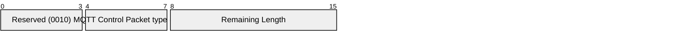

# 3.8 SUBSCRIBE - Subscribe request

The SUBSCRIBE packet is sent from the Client to the Server to create one or more Subscriptions. Each Subscription registers a Client's interest in one or more Topics. The Server sends PUBLISH packets to the Client to forward Application Messages that were published to Topics that match these Subscriptions. The SUBSCRIBE packet also specifies (for each Subscription) the maximum QoS with which the Server can send Application Messages to the Client.

## 3.8.1 SUBSCRIBE Fixed Header

Figure 3-18 SUBSCRIBE packet Fixed Header

| **Bit** | **7** | **6** | **5** | **4** | **3** | **2** | **1** | **0** |
| ------- | ----- | ----- | ----- | ----- | ----- | ----- | ----- | ----- |
| byte 1  | **MQTT Control Packet type (8)** |       |       |       | **Reserved** |       |       |       |
|         | 1     | 0     | 0     | 0     | 0     | 0     | 1     | 0     |
| byte 2  | **Remaining Length** |       |       |       |       |       |       |       |

Bits 3,2,1 and 0 of the Fixed Header of the SUBSCRIBE packet are reserved and MUST be set to 0,0,1 and 0 respectively. The Server MUST treat any other value as malformed and close the Network Connection [MQTT-3.8.1-1].

**Remaining Length field**

This is the length of Variable Header plus the length of the Payload, encoded as a Variable Byte Integer.

## 3.8.2 SUBSCRIBE Variable Header

The Variable Header of the SUBSCRIBE Packet contains the following fields in the order: Packet Identifier, and Properties. [Section 2.2.1](2-mqtt-control-packets.md#221-packet-identifier) provides more information about Packet Identifiers. The rules for encoding Properties are described in [section 2.2.2](2-mqtt-control-packets.md#222-properties).

**Non-normative example**

Figure 3-19 shows an example of a SUBSCRIBE variable header with a Packet Identifier of 10 and no properties.

Figure 3-19 – SUBSCRIBE Variable Header example

| | **Description** | **7** | **6** | **5** | **4** | **3** | **2** | **1** | **0** |
| ----------------- | -------------------------- | ----- | ----- | ----- | ----- | ----- | ----- | ----- | ----- |
| **Packet Identifier** |                            |       |       |       |       |       |       |       |       |
| byte 1            | Packet Identifier MSB (0)  | 0     | 0     | 0     | 0     | 0     | 0     | 0     | 0     |
| byte 2            | Packet Identifier LSB (10) | 0     | 0     | 0     | 0     | 1     | 0     | 1     | 0     |
| byte 3            | Property Length (0)        | 0     | 0     | 0     | 0     | 0     | 0     | 0     | 0     |

### 3.8.2.1 SUBSCRIBE Properties

#### 3.8.2.1.1 Property Length

The length of Properties in the SUBSCRIBE packet Variable Header encoded as a Variable Byte Integer.

#### 3.8.2.1.2 Subscription Identifier

**11 (0x0B) Byte,** Identifier of the Subscription Identifier.

Followed by a Variable Byte Integer representing the identifier of the subscription. The Subscription Identifier can have the value of 1 to 268,435,455. It is a Protocol Error if the Subscription Identifier has a value of 0. It is a Protocol Error to include the Subscription Identifier more than once.

The Subscription Identifier is associated with any subscription created or modified as the result of this SUBSCRIBE packet. If there is a Subscription Identifier, it is stored with the subscription. If this property is not specified, then the absence of a Subscription Identifier is stored with the subscription.

Refer to [section 3.8.3.1](#3831-subscription-options) for more information about the handling of Subscription Identifiers.

#### 3.8.2.1.3 User Property

**38 (0x26) Byte**, Identifier of the User Property.

Followed by a UTF-8 String Pair.

The User Property is allowed to appear multiple times to represent multiple name, value pairs. The same name is allowed to appear more than once.

**Non-normative comment**

User Properties on the SUBSCRIBE packet can be used to send subscription related properties from the Client to the Server. The meaning of these properties is not defined by this specification.

## 3.8.3 SUBSCRIBE Payload

The Payload of a SUBSCRIBE packet contains a list of Topic Filters indicating the Topics to which the Client wants to subscribe. The Topic Filters MUST be a UTF-8 Encoded String [MQTT-3.8.3-1]. Each Topic Filter is followed by a Subscription Options byte.

The Payload MUST contain at least one Topic Filter and Subscription Options pair [MQTT-3.8.3-2]. A SUBSCRIBE packet with no Payload is a Protocol Error. Refer to [section 4.13](4-operational-behavior.md#413-handling-errors) for information about handling errors.

### 3.8.3.1 Subscription Options

Bits 0 and 1 of the Subscription Options represent Maximum QoS field. This gives the maximum QoS level at which the Server can send Application Messages to the Client. It is a Protocol Error if the Maximum QoS field has the value 3.

Bit 2 of the Subscription Options represents the No Local option. If the value is 1, Application Messages MUST NOT be forwarded to a connection with a ClientID equal to the ClientID of the publishing connection [MQTT-3.8.3-3]. It is a Protocol Error to set the No Local bit to 1 on a Shared Subscription [MQTT-3.8.3-4].

Bit 3 of the Subscription Options represents the Retain As Published option. If 1, Application Messages forwarded using this subscription keep the RETAIN flag they were published with. If 0, Application Messages forwarded using this subscription have the RETAIN flag set to 0. Retained messages sent when the subscription is established have the RETAIN flag set to 1.

Bits 4 and 5 of the Subscription Options represent the Retain Handling option. This option specifies whether retained messages are sent when the subscription is established. This does not affect the sending of retained messages at any point after the subscribe. If there are no retained messages matching the Topic Filter, all of these values act the same. The values are:

0 = Send retained messages at the time of the subscribe

1 = Send retained messages at subscribe only if the subscription does not currently exist

2 = Do not send retained messages at the time of the subscribe

It is a Protocol Error to send a Retain Handling value of 3.

Bits 6 and 7 of the Subscription Options byte are reserved for future use. The Server MUST treat a SUBSCRIBE packet as malformed if any of Reserved bits in the Payload are non-zero [MQTT-3.8.3-5].

**Non-normative comment**

The No Local and Retain As Published subscription options can be used to implement bridging where the Client is sending the message on to another Server.

**Non-normative comment**

Not sending retained messages for an existing subscription is useful when a reconnect is done and the Client is not certain whether the subscriptions were completed in the previous connection to the Session.

**Non-normative comment**

Not sending stored retained messages because of a new subscription is useful where a Client wishes to receive change notifications and does not need to know the initial state.

**Non-normative comment**

For a Server that indicates it does not support retained messages, all valid values of Retain As Published and Retain Handling give the same result which is to not send any retained messages at subscribe and to set the RETAIN flag to 0 for all messages.

Figure 3-20 – SUBSCRIBE packet Payload format

| **Description** | **7** | **6** | **5** | **4** | **3** | **2** | **1** | **0** |
| -------------------- | ------------ | ----- | --------------- | ----- | ----- | ----- | ----- | ----- |
| **Topic Filter** |              |       |                 |       |       |       |       |       |
| byte 1               | Length MSB   |       |                 |       |       |       |       |       |
| byte 2               | Length LSB   |       |                 |       |       |       |       |       |
| bytes 3..N           | Topic Filter |       |                 |       |       |       |       |       |
| **Subscription Options** |              |       |                 |       |       |       |       |       |
|                      | Reserved     |       | Retain Handling |       | RAP   | NL    | QoS   |       |
| byte N+1             | 0            | 0     | X               | X     | X     | X     | X     | X     |

RAP means Retain as Published.

NL means No Local.

**Non-normative example**

Figure 3.21 show the SUBSCRIBE Payload example with two Topic Filters. The first is `a/b` with QoS 1, and the second is `c/d` with QoS 2.

Figure 3-21 - Payload byte format non-normative example

| | **Description** | **7** | **6** | **5** | **4** | **3** | **2** | **1** | **0** |
| -------------------- | ------------------------ | ----- | ----- | ----- | ----- | ----- | ----- | ----- | ----- |
| **Topic Filter** |                          |       |       |       |       |       |       |       |       |
| byte 1               | Length MSB (0)           | 0     | 0     | 0     | 0     | 0     | 0     | 0     | 0     |
| byte 2               | Length LSB (3)           | 0     | 0     | 0     | 0     | 0     | 0     | 1     | 1     |
| byte 3               | `a` (0x61)               | 0     | 1     | 1     | 0     | 0     | 0     | 0     | 1     |
| byte 4               | `/` (0x2F)               | 0     | 0     | 1     | 0     | 1     | 1     | 1     | 1     |
| byte 5               | `b` (0x62)               | 0     | 1     | 1     | 0     | 0     | 0     | 1     | 0     |
| **Subscription Options** |                          |       |       |       |       |       |       |       |       |
| byte 6               | Subscription Options (1) | 0     | 0     | 0     | 0     | 0     | 0     | 0     | 1     |
| **Topic Filter** |                          |       |       |       |       |       |       |       |       |
| byte 7               | Length MSB (0)           | 0     | 0     | 0     | 0     | 0     | 0     | 0     | 0     |
| byte 8               | Length LSB (3)           | 0     | 0     | 0     | 0     | 0     | 0     | 1     | 1     |
| byte 9               | `c` (0x63)               | 0     | 1     | 1     | 0     | 0     | 0     | 1     | 1     |
| byte 10              | `/` (0x2F)               | 0     | 0     | 1     | 0     | 1     | 1     | 1     | 1     |
| byte 11              | `d` (0x64)               | 0     | 1     | 1     | 0     | 0     | 1     | 0     | 0     |
| **Subscription Options** |                          |       |       |       |       |       |       |       |       |
| byte 12              | Subscription Options (2) | 0     | 0     | 0     | 0     | 0     | 0     | 1     | 0     |

## 3.8.4 SUBSCRIBE Actions

When the Server receives a SUBSCRIBE packet from a Client, the Server MUST respond with a SUBACK packet [MQTT-3.8.4-1]. The SUBACK packet MUST have the same Packet Identifier as the SUBSCRIBE packet that it is acknowledging [MQTT-3.8.4-2].

The Server is permitted to start sending PUBLISH packets matching the Subscription before the Server sends the SUBACK packet.

If a Server receives a SUBSCRIBE packet containing a Topic Filter that is identical to a Non-shared Subscription's Topic Filter for the current Session, then it MUST replace that existing Subscription with a new Subscription [MQTT-3.8.4-3]. The Topic Filter in the new Subscription will be identical to that in the previous Subscription, although its Subscription Options could be different. If the Retain Handling option is 0, any existing retained messages matching the Topic Filter MUST be re-sent, but Applicaton Messages MUST NOT be lost due to replacing the Subscription [MQTT-3.8.4-4].

If a Server receives a Non-shared Topic Filter that is not identical to any Topic Filter for the current Session, a new Non-shared Subscription is created. If the Retain Handling option is not 2, all matching retained messages are sent to the Client.

If a Server receives a Topic Filter that is identical to the Topic Filter for a Shared Subscription that already exists on the Server, the Session is added as a subscriber to that Shared Subscription. No retained messages are sent.

If a Server receives a Shared Subscription Topic Filter that is not identical to any existing Shared Subscription's Topic Filter, a new Shared Subscription is created. The Session is added as a subscriber to that Shared Subscription. No retained messages are sent.

Refer to [section 4.8](4-operational-behavior.md#48-shared-subscriptions) for more details on Shared Subscriptions.

If a Server receives a SUBSCRIBE packet that contains multiple Topic Filters it MUST handle that packet as if it had received a sequence of multiple SUBSCRIBE packets, except that it combines their responses into a single SUBACK response [MQTT-3.8.4-5].

The SUBACK packet sent by the Server to the Client MUST contain a Reason Code for each Topic Filter/Subscription Option pair [MQTT-3.8.4-6]. This Reason Code MUST either show the maximum QoS that was granted for that Subscription or indicate that the subscription failed [MQTT-3.8.4-7]. The Server might grant a lower Maximum QoS than the subscriber requested. The QoS of Application Messages sent in response to a Subscription MUST be the minimum of the QoS of the originally published message and the Maximum QoS granted by the Server [MQTT-3.8.4-8]. The server is permitted to send duplicate copies of a message to a subscriber in the case where the original message was published with QoS 1 and the maximum QoS granted was QoS 0.

**Non-normative comment**

If a subscribing Client has been granted maximum QoS 1 for a particular Topic Filter, then a QoS 0 Application Message matching the filter is delivered to the Client at QoS 0. This means that at most one copy of the message is received by the Client. On the other hand, a QoS 2 Message published to the same topic is downgraded by the Server to QoS 1 for delivery to the Client, so that Client might receive duplicate copies of the Message.

**Non-normative comment**

If the subscribing Client has been granted maximum QoS 0, then an Application Message originally published as QoS 2 might get lost on the hop to the Client, but the Server should never send a duplicate of that Message. A QoS 1 Message published to the same topic might either get lost or duplicated on its transmission to that Client.

**Non-normative comment**

Subscribing to a Topic Filter at QoS 2 is equivalent to saying "I would like to receive Messages matching this filter at the QoS with which they were published". This means a publisher is responsible for determining the maximum QoS a Message can be delivered at, but a subscriber is able to require that the Server downgrades the QoS to one more suitable for its usage.

The Subscription Identifiers are part of the Session State in the Server and are returned to the Client receiving a matching PUBLISH packet. They are removed from the Server's Session State when the Server receives an UNSUBSCRIBE packet, when the Server receives a SUBSCRIBE packet from the Client for the same Topic Filter but with a different Subscription Identifier or with no Subscription Identifier, or when the Server sends Session Present 0 in a CONNACK packet.

The Subscription Identifiers do not form part of the Client's Session State in the Client. In a useful implementation, a Client will associate the Subscription Identifiers with other Client side state, this state is typically removed when the Client unsubscribes, when the Client subscribes for the same Topic Filter with a different identifier or no identifier, or when the Client receives Session Present 0 in a CONNACK packet.

The Server need not use the same set of Subscription Identifiers in the retransmitted PUBLISH packet. The Client can remake a Subscription by sending a SUBSCRIBE packet containing a Topic Filter that is identical to the Topic Filter of an existing Subscription in the current Session. If the Client remade a subscription after the initial transmission of a PUBLISH packet and used a different Subscription Identifier, then the Server is allowed to use the identifiers from the first transmission in any retransmission. Alternatively, the Server is allowed to use the new identifiers during a retransmission. The Server is not allowed to revert to the old identifier after it has sent a PUBLISH packet containing the new one.

**Non-normative comment**

Usage scenarios, for illustration of Subscription Identifiers.

- The Client implementation indicates via its programming interface that a publication matched more than one subscription. The Client implementation generates a new identifier each time a subscription is made. If the returned publication carries more than one Subscription Identifier, then the publication matched more than one subscription.

- The Client implementation allows the subscriber to direct messages to a callback associated with the subscription. The Client implementation generates an identifier which uniquely maps the identifier to the callback. When a publication is received it uses the Subscription Identifier to determine which callback is driven.

- The Client implementation returns the topic string used to make the subscription to the application when it delivers the published message. To achieve this the Client generates an identifier which uniquely identifies the Topic Filter. When a publication is received the Client implementation uses the identifiers to look up the original Topic Filters and return them to the Client application.

- A gateway forwards publications received from a Server to Clients that have made subscriptions to the gateway. The gateway implementation maintains a map of each unique Topic Filter it receives to the set of ClientID, Subscription Identifier pairs that it also received. It generates a unique identifier for each Topic Filter that it forwards to the Server. When a publication is received, the gateway uses the Subscription Identifiers it received from the Server to look up the Client Identifier, Subscription Identifier pairs associated with them. It adds these to the PUBLISH packets it sends to the Clients. If the upstream Server sent multiple PUBLISH packets because the message matched multiple subscriptions, then this behavior is mirrored to the Clients.
