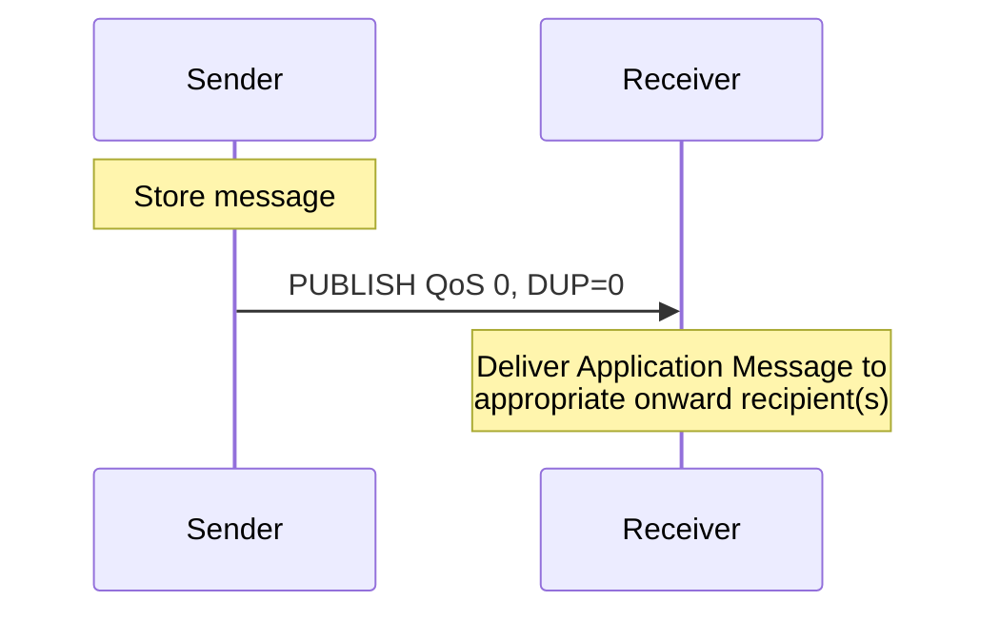
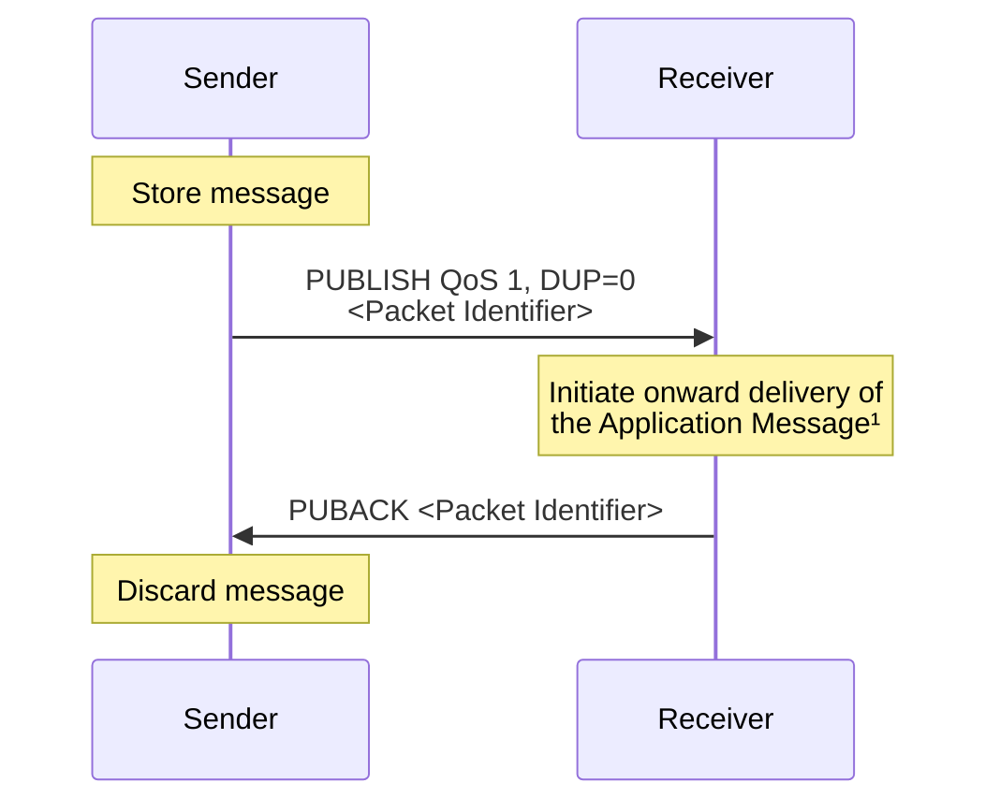
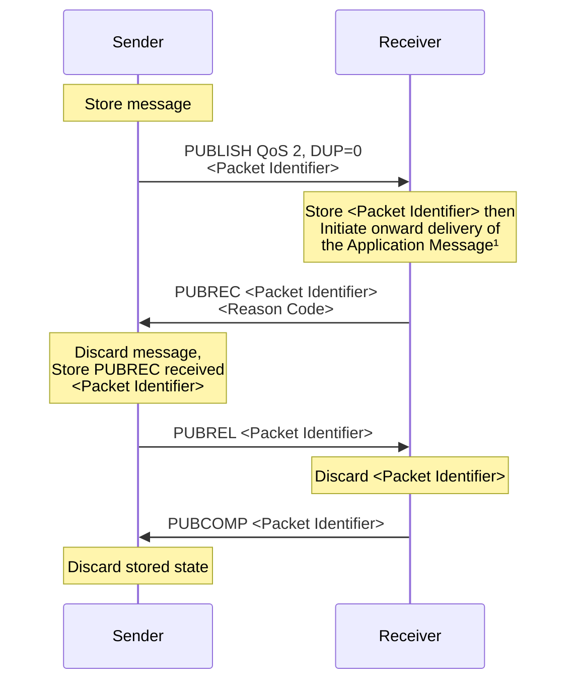

# 4.3 Quality of Service levels and protocol flows

MQTT delivers Application Messages according to the Quality of Service (QoS) levels defined in the following sections. The delivery protocol is symmetric, in the description below the Client and Server can each take the role of either sender or receiver. The delivery protocol is concerned solely with the delivery of an application message from a single sender to a single receiver. When the Server is delivering an Application Message to more than one Client, each Client is treated independently. The QoS level used to deliver an Application Message outbound to the Client could differ from that of the inbound Application Message.

## 4.3.1 QoS 0: At most once delivery

The message is delivered according to the capabilities of the underlying network. No response is sent by the receiver and no retry is performed by the sender. The message arrives at the receiver either once or not at all.

In the QoS 0 delivery protocol, the sender

- MUST send a PUBLISH packet with QoS 0 and DUP flag set to 0 \[MQTT-4.3.1-1\].

In the QoS 0 delivery protocol, the receiver

- Accepts ownership of the message when it receives the PUBLISH packet.

### Figure 4.1 – QoS 0 protocol flow diagram

| **Sender Action**    | **Control Packet** | **Receiver Action**                                            |
| -------------------- | ------------------ | -------------------------------------------------------------- |
| PUBLISH QoS 0, DUP=0 | \---------->       | Deliver Application Message to appropriate onward recipient(s) |

## 4.3.2 QoS 1: At least once delivery

This Quality of Service level ensures that the message arrives at the receiver at least once. A QoS 1 PUBLISH packet has a Packet Identifier in its Variable Header and is acknowledged by a PUBACK packet. [Section 2.2.1](2.2_packet-format.md#221-packet-identifier) provides more information about Packet Identifiers.

In the QoS 1 delivery protocol, the sender

- MUST assign an unused Packet Identifier each time it has a new Application Message to publish \[MQTT-4.3.2-1\].

- MUST send a PUBLISH packet containing this Packet Identifier with QoS 1 and DUP flag set to 0 \[MQTT-4.3.2-2\].

- MUST treat the PUBLISH packet as `unacknowledged` until it has received the corresponding PUBACK packet from the receiver. Refer to [section 4.4](4.4_message-delivery-retry.md) for a discussion of unacknowledged messages \[MQTT-4.3.2-3\].

The Packet Identifier becomes available for reuse once the sender has received the PUBACK packet.

Note that a sender is permitted to send further PUBLISH packets with different Packet Identifiers while it is waiting to receive acknowledgements.

In the QoS 1 delivery protocol, the receiver

- MUST respond with a PUBACK packet containing the Packet Identifier from the incoming PUBLISH packet, having accepted ownership of the Application Message \[MQTT-4.3.2-4\].
- After it has sent a PUBACK packet the receiver MUST treat any incoming PUBLISH packet that contains the same Packet Identifier as being a new Application Message, irrespective of the setting of its DUP flag \[MQTT-4.3.2-5\].

### Figure 4.2 – QoS 1 protocol flow diagram

| **Sender Action**                              | **MQTT Control Packet** | **Receiver action**                                  |
| ---------------------------------------------- | ----------------------- | ---------------------------------------------------- |
| Store message                                  |                         |                                                      |
| Send PUBLISH QoS 1, DUP=0, <Packet Identifier> | \---------->            |                                                      |
|                                                |                         | Initiate onward delivery of the Application Message1 |
|                                                | <----------             | Send PUBACK <Packet Identifier>                      |
| Discard message                                |                         |                                                      |

1 The receiver does not need to complete delivery of the Application Message before sending the PUBACK. When its original sender receives the PUBACK packet, ownership of the Application Message is transferred to the receiver.

## 4.3.3 QoS 2: Exactly once delivery

This is the highest Quality of Service level, for use when neither loss nor duplication of messages are acceptable. There is an increased overhead associated with QoS 2.

A QoS 2 message has a Packet Identifier in its Variable Header. [Section 2.2.1](2.2_packet-format.md#221-packet-identifier) provides more information about Packet Identifiers. The receiver of a QoS 2 PUBLISH packet acknowledges receipt with a two-step acknowledgement process.

In the QoS 2 delivery protocol, the sender:

- MUST assign an unused Packet Identifier when it has a new Application Message to publish \[MQTT-4.3.3-1\].
- MUST send a PUBLISH packet containing this Packet Identifier with QoS 2 and DUP flag set to 0 \[MQTT-4.3.3-2\].
- MUST treat the PUBLISH packet as `unacknowledged` until it has received the corresponding PUBREC packet from the receiver \[MQTT-4.3.3-3\]. Refer to [section 4.4](4.4_message-delivery-retry.md) for a discussion of unacknowledged messages.
- MUST send a PUBREL packet when it receives a PUBREC packet from the receiver with a Reason Code value less than 0x80. This PUBREL packet MUST contain the same Packet Identifier as the original PUBLISH packet \[MQTT-4.3.3-4\].
- MUST treat the PUBREL packet as `unacknowledged` until it has received the corresponding PUBCOMP packet from the receiver \[MQTT-4.3.3-5\].
- MUST NOT re-send the PUBLISH once it has sent the corresponding PUBREL packet \[MQTT-4.3.3-6\].
- MUST NOT apply Message expiry if a PUBLISH packet has been sent \[MQTT-4.3.3-7\].

The Packet Identifier becomes available for reuse once the sender has received the PUBCOMP packet or a PUBREC with a Reason Code of 0x80 or greater.

Note that a sender is permitted to send further PUBLISH packets with different Packet Identifiers while it is waiting to receive acknowledgements, subject to flow control as described in [section 4.9](4-operational-behavior.md#49-flow-control).

In the QoS 2 delivery protocol, the receiver:

- MUST respond with a PUBREC containing the Packet Identifier from the incoming PUBLISH packet, having accepted ownership of the Application Message \[MQTT-4.3.3-8\].
- If it has sent a PUBREC with a Reason Code of 0x80 or greater, the receiver MUST treat any subsequent PUBLISH packet that contains that Packet Identifier as being a new Application Message \[MQTT-4.3.3-9\].
- Until it has received the corresponding PUBREL packet, the receiver MUST acknowledge any subsequent PUBLISH packet with the same Packet Identifier by sending a PUBREC. It MUST NOT cause duplicate messages to be delivered to any onward recipients in this case \[MQTT-4.3.3-10\].
- MUST respond to a PUBREL packet by sending a PUBCOMP packet containing the same Packet Identifier as the PUBREL \[MQTT-4.3.3-11\].
- After it has sent a PUBCOMP, the receiver MUST treat any subsequent PUBLISH packet that contains that Packet Identifier as being a new Application Message \[MQTT-4.3.3-12\].
- MUST continue the QoS 2 acknowledgement sequence even if it has applied message expiry \[MQTT-4.3.3-13\].

### Figure 4.3 – QoS 2 protocol flow diagram

| **Sender Action**                                          | **MQTT Control Packet** | **Receiver Action**                                                                 |
| ---------------------------------------------------------- | ----------------------- | ----------------------------------------------------------------------------------- |
| Store message                                              |                         |                                                                                     |
| PUBLISH QoS 2, DUP=0   <Packet Identifier>              |                         |                                                                                     |
|                                                            | \---------->            |                                                                                     |
|                                                            |                         | Store <Packet Identifier> then Initiate onward delivery of the Application Message1 |
|                                                            |                         | PUBREC <Packet Identifier><Reason Code>                                             |
|                                                            | <----------             |                                                                                     |
| Discard message, Store PUBREC received <Packet Identifier> |                         |                                                                                     |
| PUBREL <Packet Identifier>                                 |                         |                                                                                     |
|                                                            | \---------->            |                                                                                     |
|                                                            |                         | Discard <Packet Identifier>                                                         |
|                                                            |                         | Send PUBCOMP <Packet Identifier>                                                    |
|                                                            | <----------             |                                                                                     |
| Discard stored state                                       |                         |                                                                                     |

1 The receiver does not need to complete delivery of the Application Message before sending the PUBREC or PUBCOMP. When its original sender receives the PUBREC packet, ownership of the Application Message is transferred to the receiver. However, the receiver needs to perform all checks for conditions which might result in a forwarding failure (e.g. quota exceeded, authorization, etc.) before accepting ownership. The receiver indicates success or failure using the appropriate Reason Code in the PUBREC.
